# 🧹 Chore Roster — a shared household chores tracker

> Built for **[Homework 1: AI-Native Developer Workflow](https://courses.datatalks.club/ai-dev-tools-2026/homework/hw1)** of the
> [AI Dev Tools Zoomcamp 2026](https://github.com/DataTalksClub/ai-dev-tools-zoomcamp) by [DataTalks.Club](https://datatalks.club).
>
> The assignment starts from one vague line — *"a tool for managing shared household chores"* — and asks you to turn it into a
> spec, a backlog, and a working Django app, using an AI coding agent for the whole journey. This repo is the result.

**Chore Roster** answers the question every shared flat argues about: *whose turn is it, and is the workload actually fair?*
Chores rotate automatically through housemates, each completion is logged with points, and the dashboard shows who's behind.

The name **Chore Roster** is used consistently everywhere — the repository directory, `pyproject.toml`, the UI, and
these docs.

---

## Table of contents

- [Screens & features](#screens--features)
- [Architecture](#architecture)
  - [Dependencies](#dependencies)
- [Quickstart](#quickstart)
- [Running it locally on Ubuntu — a walkthrough](#running-it-locally-on-ubuntu--a-walkthrough)
  - [Steps 1–7: install and run](#step-1--get-the-code-and-check-your-toolchain)
  - [Step 8: the rest of the app](#step-8--the-rest-of-the-app)
  - [Step 9: watching the API](#step-9--watching-the-api-from-the-terminal)
- [Project structure](#project-structure)
- [Data model](#data-model)
- [Core rules](#core-rules)
- [REST API reference](#rest-api-reference)
- [Frontend](#frontend)
- [Testing](#testing)
- [Management commands](#management-commands)
- [Django admin](#django-admin)
- [Configuration](#configuration)
- [Homework answers](#homework-answers)
- [The AI-native workflow used](#the-ai-native-workflow-used)
- [Roadmap](#roadmap)
- [Troubleshooting](#troubleshooting)
- [License](#license)

---

## Screens & features

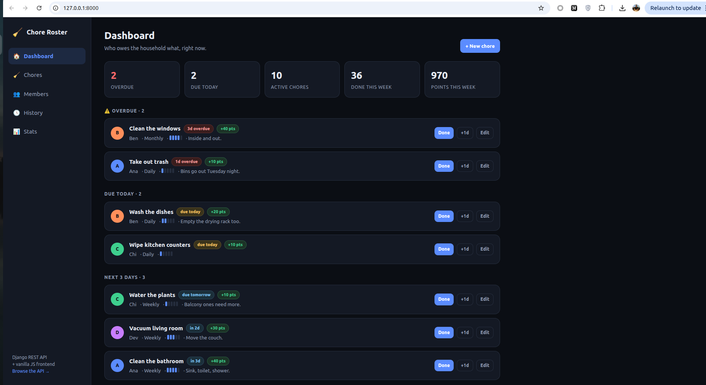

<table>
<tr>
<td width="50%">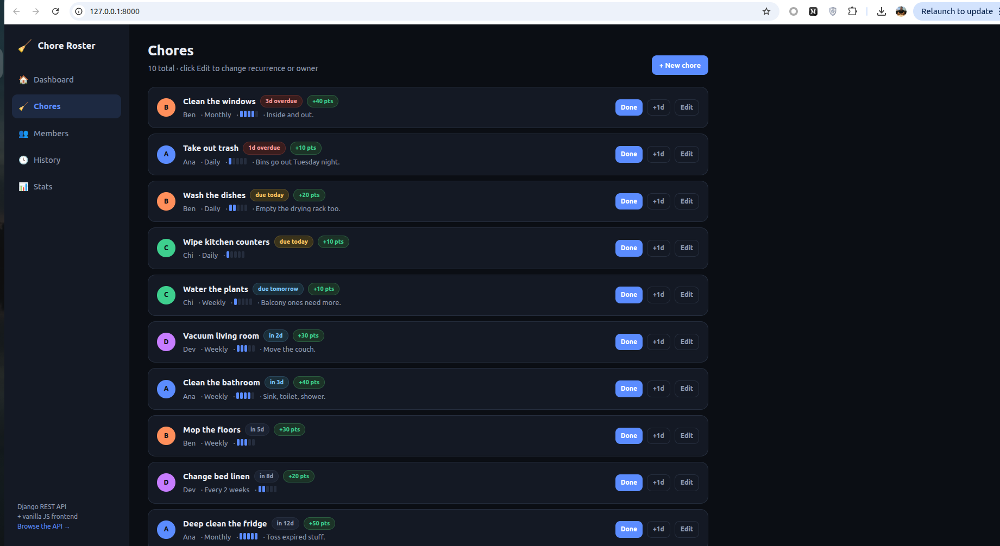<br><em>Chores — the full catalog</em></td>
<td width="50%">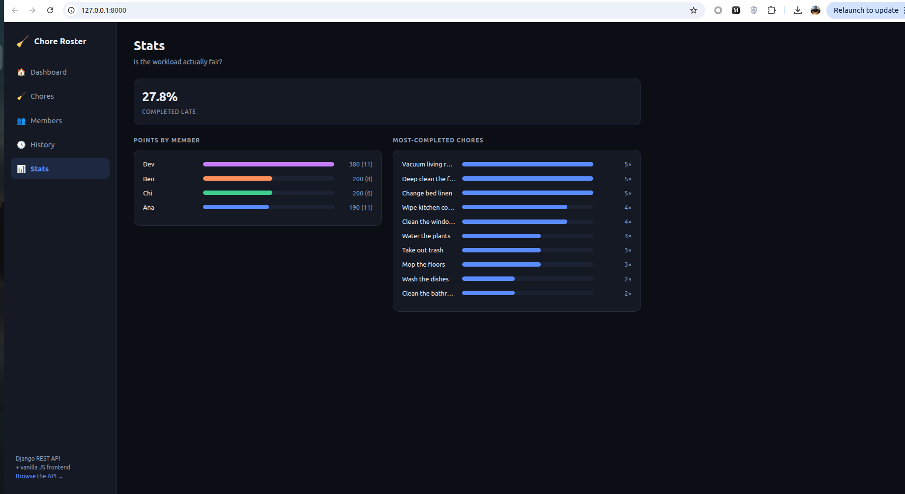<br><em>Stats — is the workload fair?</em></td>
</tr>
<tr>
<td width="50%">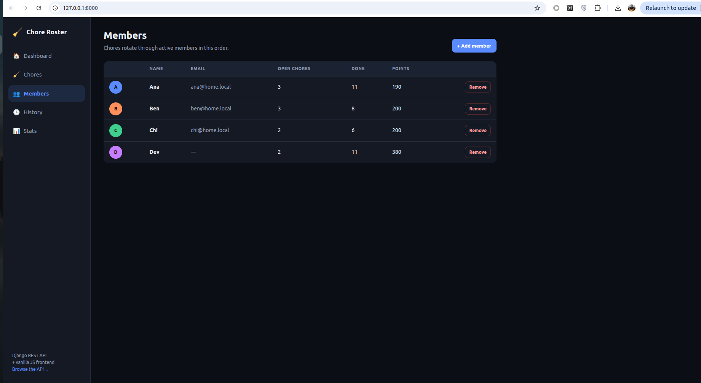<br><em>Members — the rotation order</em></td>
<td width="50%">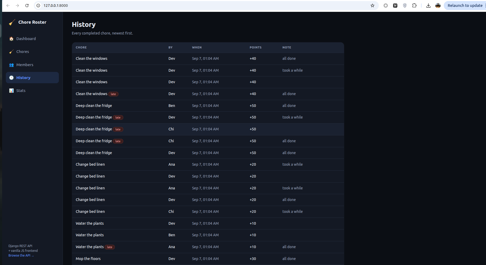<br><em>History — the append-only audit log</em></td>
</tr>
</table>

| Screen | What it does |
|---|---|
| **Dashboard** | Live counters (overdue, due today, active, done this week, points this week), chores bucketed into **Overdue → Due today → Next 3 days → Later**, a points leaderboard, and a recent-activity feed. |
| **Chores** | Full list of every chore with owner, recurrence, difficulty and due date. Create, edit and delete from a modal. |
| **Members** | Add/remove housemates. Shows open chore count, completions and total points per person. Each member gets an auto-assigned avatar colour. |
| **History** | Immutable log of every completion: chore, who did it, when, points awarded, late flag, note. |
| **Stats** | Points-by-member and most-completed-chore bar charts, plus an overall **late rate** so you can see if the rota is realistic. |

### Feature highlights

1. **Household members** — add, list, deactivate and remove the people sharing the rota.
2. **Chore catalog with recurrence** — daily / weekly / every-2-weeks / monthly, a 1–5 difficulty rating, and an owner.
3. **One-click "Done" with automatic rotation** — logs a completion, awards points, rotates the chore to the next active
   member, and rolls the due date forward (catching up if the chore was badly overdue). Plus a **snooze** action.
4. **Dashboard, leaderboard, history and fairness stats** — everything the household needs to settle arguments with data.

---

## Architecture

```
┌────────────────────────────┐         ┌──────────────────────────────────┐
│   Frontend (SPA)           │  fetch  │   Backend (Django + DRF)         │
│   frontend/app.js          │ ──────► │   /api/members/      CRUD        │
│   frontend/styles.css      │  JSON   │   /api/chores/       CRUD        │
│   vanilla JS, no build step│ ◄────── │   /api/chores/:id/done/          │
│   hash-free client routing │         │   /api/chores/:id/snooze/        │
└────────────────────────────┘         │   /api/completions/  read-only   │
             ▲                         │   /api/dashboard/    aggregate   │
             │ served as static        │   /api/stats/        aggregate   │
             │ by Django               └──────────────┬───────────────────┘
             │                                        │ Django ORM
     templates/index.html                     ┌───────▼────────┐
     (SPA shell)                              │  SQLite (dev)  │
                                              └────────────────┘
```

**Why this shape?** The backend is a pure JSON API (Django REST Framework) with no server-rendered HTML beyond a single
SPA shell. That means the frontend is genuinely decoupled — you could swap in React/Vue, or point a mobile app at the same
API, without touching the backend. But there's **no build step**: the frontend is plain ES2020 served as Django static
files, so `runserver` is the only process you ever need.

**Stack**

| Layer | Choice | Why |
|---|---|---|
| Backend | Django | Batteries included: ORM, migrations, admin, test runner |
| API | Django REST Framework | ViewSets + serializers + a browsable API for free |
| CORS | django-cors-headers | Lets you host the frontend separately if you ever want to |
| DB | SQLite | Zero setup for dev; swap `DATABASES` for Postgres in prod |
| Frontend | Vanilla JS + CSS | No bundler, no `node_modules`, readable in one sitting |
| Tests | `django.test` + DRF `APITestCase` | Ships with the framework, runs in ~0.1s |

### Dependencies

`pyproject.toml` is the authoritative dependency list; `requirements.txt` mirrors it so
that plain `pip` users aren't left out. Both declare the same three direct dependencies
with **lower bounds rather than exact pins**, so a fresh install picks up current
security patches.

```toml
# pyproject.toml
[project]
name = "chore-roster"
version = "1.0.0"
description = "Chore Roster — a shared household chores tracker (Django REST backend + JS frontend)"
requires-python = ">=3.12"
dependencies = [
    "django>=5.0",
    "djangorestframework>=3.15",
    "django-cors-headers>=4.4",
]
```

```text
# requirements.txt
Django>=5.0
djangorestframework>=3.15
django-cors-headers>=4.4
```

| Package | Declared | Verified with | Role |
|---|---|---|---|
| `django` | `>=5.0` | 6.1.1 | ORM, migrations, admin, dev server, test runner |
| `djangorestframework` | `>=3.15` | 3.18.0 | serializers, ViewSets, the browsable API |
| `django-cors-headers` | `>=4.4` | 4.9.0 | CORS headers, for hosting the frontend separately |
| `asgiref` | — | 3.12.1 | pulled in by Django (async adapter) |
| `sqlparse` | — | 0.6.0 | pulled in by Django (SQL formatting) |

`requires-python = ">=3.12"` matches the interpreter the project is developed and
tested against. Django 5.0 itself still supports 3.10, so if you're stuck on an older
interpreter you can lower that bound — but nothing here has been verified below 3.12.

There are **no frontend dependencies at all**: no `package.json`, no `node_modules`, no
build step. The UI is plain ES2020 and hand-written CSS served straight out of
`frontend/` as Django static files.

---

## Quickstart

### With `uv` (recommended)

```bash
git clone <your-repo-url>
cd chore-roster

uv venv
uv pip install -r requirements.txt

uv run python manage.py migrate
uv run python manage.py seed --fresh      # optional demo data
uv run python manage.py runserver
```

### With plain `pip`

```bash
python -m venv .venv && source .venv/bin/activate    # Windows: .venv\Scripts\activate
pip install -r requirements.txt
python manage.py migrate
python manage.py seed --fresh
python manage.py runserver
```

Then open:

| URL | What |
|---|---|
| <http://127.0.0.1:8000/> | The app |
| <http://127.0.0.1:8000/api/> | DRF browsable API |
| <http://127.0.0.1:8000/admin/> | Django admin (create a superuser first) |

---

## Running it locally on Ubuntu — a walkthrough

A step-by-step log of setting this project up from scratch on a clean Ubuntu machine,
with real terminal output at every stage. Tested on **Ubuntu 22.04** with `uv`.

### Step 1 — Get the code and check your toolchain

Unpack the project (or clone it), move into the directory, and confirm what you're
working with:

```bash
unzip chore-roster.zip -d ~
cd ~/chore-roster

# confirm you're in the project root — you should see manage.py
ls -la

# check the interpreter and package manager
python3 --version
uv --version
```

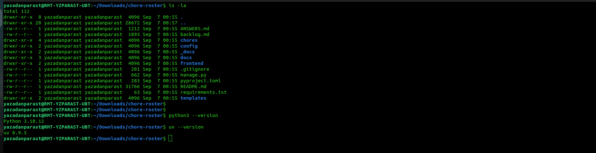

**What to look for.** The listing must contain `manage.py`, plus the `chores/`,
`config/`, `frontend/` and `templates/` directories — that confirms you're in the
project root and not one level above it. You should also see `docs/` (the walkthrough
screenshots) and `_docs/` (the spec).

Equally important is what's **absent**: there's no `db.sqlite3` and no `.venv/`. Both
are listed in `.gitignore` and are built locally in the next two steps, which is exactly
how a freshly cloned checkout should look.

Note the two versions at the bottom of the output:

| Tool | Found here | Required |
|---|---|---|
| Python | `3.10.12` | **3.12+** — see `requires-python` in `pyproject.toml` |
| `uv` | `0.9.5` | any recent version |

The system Python being 3.10 is **not a blocker**, and you should *not* upgrade or
replace it — Ubuntu's own tooling depends on the system interpreter. Instead, `uv` can
download a private, self-contained Python 3.12 just for this project, which is what the
next step does. If `uv --version` says *command not found*, install it with
`curl -LsSf https://astral.sh/uv/install.sh | sh`, or skip `uv` entirely and use the
plain `venv` route shown in [Quickstart](#quickstart).

### Step 2 — Create an isolated environment and install dependencies

Rather than upgrading the system Python, create a project-local virtual environment
pinned to 3.12 and install the dependencies into it:

```bash
cd ~/chore-roster

# create a venv on Python 3.12 — uv downloads it automatically if it isn't present
uv venv --python 3.12

# install Django, DRF and django-cors-headers into that venv
uv pip install -r requirements.txt
```

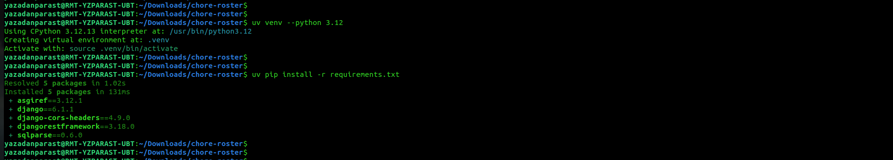

**What happened.** `uv` found an existing `/usr/bin/python3.12` on this machine and
reused it, so no download was needed — dependency resolution took about a second and
the install itself **131 ms**. Five packages land in `.venv/`:

| Package | Version | Role |
|---|---|---|
| `django` | 6.1.1 | the framework |
| `djangorestframework` | 3.18.0 | the REST API layer |
| `django-cors-headers` | 4.9.0 | cross-origin headers |
| `asgiref` | 3.12.1 | Django's async adapter (transitive) |
| `sqlparse` | 0.6.0 | SQL formatting for the ORM (transitive) |

Note the venv is created **at `.venv/` inside the project** and is listed in
`.gitignore`, so it never gets committed. You don't need to `source
.venv/bin/activate` — prefixing commands with `uv run` uses the venv automatically,
which is the style used throughout this walkthrough.

### Step 3 — Verify the environment

Confirm the venv really is on 3.12 and that the frameworks import cleanly:

```bash
uv run python --version
uv run python -c "import django, rest_framework; print('Django', django.__version__, '| DRF', rest_framework.VERSION)"
```

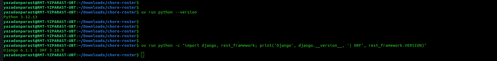

```
Python 3.12.13
Django 6.1.1 | DRF 3.18.0
```

Two things are proven here. The interpreter is **3.12.13**, not the system's 3.10 —
`uv run` transparently selected the venv. And both `django` and `rest_framework` import
without error, so the dependency install actually worked rather than just reporting
success. If this step fails with `ModuleNotFoundError`, the venv wasn't created in the
directory you're standing in — re-run Step 2 from the project root.

### Step 4 — Create the database and load demo data

The repo ignores `db.sqlite3`, so the database is built locally from the migration
files. Start from a clean slate and then seed a demo household:

```bash
cd ~/chore-roster

# start clean (safe — the DB is disposable and never committed)
rm -f db.sqlite3

# build the schema from the migration files
uv run python manage.py migrate
```

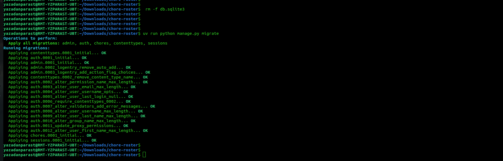

**Reading the migrate output.** Django applies migrations for five apps. Four of them
(`contenttypes`, `auth`, `admin`, `sessions`) are Django's own built-ins — they create
the user, permission and session tables that the admin site needs. The line that
matters for this project is:

```
Applying chores.0001_initial... OK
```

That single migration creates the `Member`, `Chore` and `Completion` tables. If you
ever change `chores/models.py`, generate a follow-up migration with
`uv run python manage.py makemigrations chores` and re-run `migrate`.

**Loading the demo data.** With the schema in place, seed a household to work with:

```bash
uv run python manage.py seed --fresh
```

```
Seeded 4 members, 10 chores, 36 completions.
```

Those numbers are **deterministic** — the seeder calls `random.seed(7)`, so every
machine produces the identical demo household. Getting exactly `4 / 10 / 36` confirms
the install is behaving the same as the reference environment.

The seeder deliberately creates a *messy* household rather than a tidy one: a couple of
chores are already overdue, some past completions are flagged late, and points are
unevenly distributed. That's so the dashboard's overdue bucket, the leaderboard ranking
and the late-rate stat all have something real to display the moment you open the app.

Two useful variants:

| Command | Behaviour |
|---|---|
| `manage.py seed` | seeds **only if** the database is empty — safe to re-run |
| `manage.py seed --fresh` | wipes members, chores and completions first, then re-seeds |

### Step 5 — Run the test suite

Before starting the server, prove the code behaves correctly on *your* machine:

```bash
cd ~/chore-roster

uv run python manage.py test
```

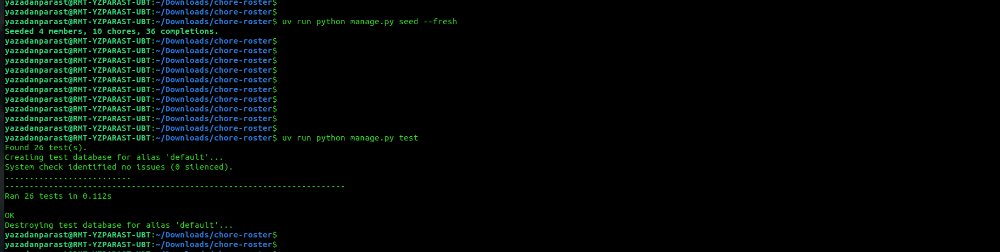

```
Found 26 test(s).
Creating test database for alias 'default'...
System check identified no issues (0 silenced).
..........................
Ran 26 tests in 0.112s

OK
```

**What to check:** the count is **26**, the progress line is 26 dots with no `F`
(failure) or `E` (error) characters, and the final word is **`OK`**. The whole suite
runs in about a tenth of a second, so there's no excuse not to run it after every
change.

Note the *"Creating test database"* / *"Destroying test database"* lines: Django builds
a **throwaway in-memory database** for the run and tears it down afterwards. The demo
household you seeded in Step 4 is never touched, so it's always safe to run the tests.

#### Seeing exactly what is covered

Add `-v 2` to print every test name as it runs — useful for confirming the edge cases
are real rather than taking the summary on faith:

```bash
uv run python manage.py test -v 2
```

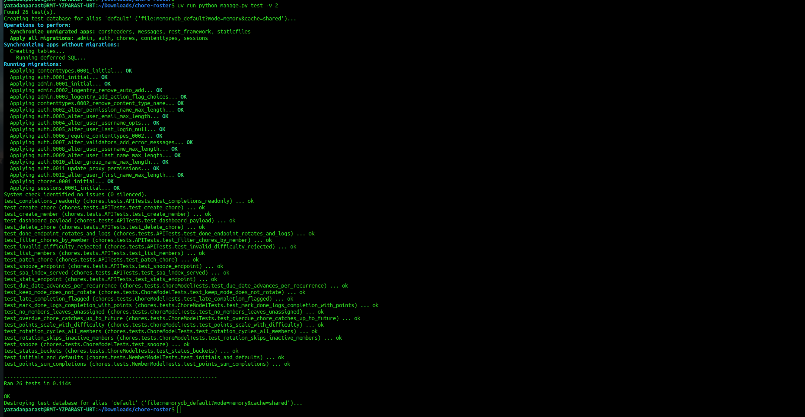

The named scenarios map directly onto the business rules described in
[Core rules](#core-rules):

| Test | Rule it locks down |
|---|---|
| `test_due_date_advances_per_recurrence` | every interval (daily → monthly) rolls forward correctly |
| `test_overdue_chore_catches_up_to_future` | a long-ignored chore doesn't come back still overdue |
| `test_rotation_cycles_all_members` | the rota wraps around the full member list |
| `test_rotation_skips_inactive_members` | deactivated housemates drop out of the rotation |
| `test_keep_mode_does_not_rotate` | `keep`-mode chores stay with one person |
| `test_no_members_leaves_unassigned` | an empty household doesn't crash `mark_done()` |
| `test_late_completion_flagged` | completions record whether they were late |
| `test_points_scale_with_difficulty` | difficulty 1–5 maps to 10–50 points |
| `test_invalid_difficulty_rejected` | the API rejects out-of-range input with a `400` |
| `test_completions_readonly` | history can't be forged via `POST` (returns `405`) |
| `test_done_endpoint_rotates_and_logs` | the `done` action logs **and** rotates in one call |
| `test_dashboard_payload` / `test_stats_endpoint` | aggregate endpoints return the expected shape |

Useful variations:

| Command | Runs |
|---|---|
| `uv run python manage.py test` | everything |
| `uv run python manage.py test chores.tests.APITests` | just the API tests |
| `uv run python manage.py test chores.tests.ChoreModelTests.test_snooze` | one single test |

### Step 6 — Start the development server

Everything is verified, so start the server:

```bash
cd ~/chore-roster

uv run python manage.py runserver
```

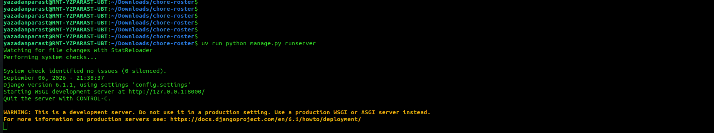

```
Watching for file changes with StatReloader
System check identified no issues (0 silenced).
Django version 6.1.1, using settings 'config.settings'
Starting WSGI development server at http://127.0.0.1:8000/
Quit the server with CONTROL-C.
```

The server runs in the **foreground and stays there** — that terminal is now busy. Open
a second tab with `Ctrl+Shift+T` if you need to run other commands. Stop it with
`Ctrl+C`.

`StatReloader` means auto-reload is on: edit any `.py` file and the server restarts
itself. The yellow *"do not use in a production setting"* warning is expected and
correct — `runserver` is a development tool; production needs gunicorn or uvicorn
behind nginx (see [Configuration](#configuration)).

| URL | What you get |
|---|---|
| <http://127.0.0.1:8000/> | the app |
| <http://127.0.0.1:8000/api/> | the DRF browsable API |
| <http://127.0.0.1:8000/admin/> | Django admin (needs `createsuperuser` first) |

### Step 7 — The app in the browser

Open <http://127.0.0.1:8000/> — the dashboard loads with the seeded household:


Everything visible here is live data fetched from the REST API by the JavaScript
frontend — a single `GET /api/dashboard/` call populates the whole screen.

**Reading the dashboard.** The five stat cards summarise the household at a glance:
**2 overdue** (in red), **2 due today**, **10 active chores**, **36 done this week**,
**970 points this week**. Below them, chores are bucketed by urgency —
*Overdue → Due today → Next 3 days → Later* — so the most pressing work is always at
the top.

Each chore row packs in a lot: a coloured avatar for the owner (`B` Ben, `A` Ana,
`C` Chi, `D` Dev), the chore name, a status pill (`3d overdue`, `due today`,
`due tomorrow`, `in 2d`), the points on offer (`+40 pts`), the recurrence, a five-bar
difficulty meter, and the description. On the right are the three actions: **Done**,
**+1d** (snooze), and **Edit**.

Try clicking **Done** on any chore. Three things happen at once, and you can watch them:
a green toast names the housemate the chore just rotated to, the chore jumps to a new
bucket with a future due date, and the points land on that member's leaderboard bar
further down the page. That single click is one `POST /api/chores/:id/done/` request.

Scroll down for the **leaderboard** and **recent activity** feed, and use the sidebar
to reach the **Chores**, **Members**, **History** and **Stats** screens. The
*"Browse the API →"* link at the bottom-left opens the DRF browsable API, where you can
poke at the same endpoints by hand.

### Step 8 — The rest of the app

The sidebar links to four more screens, all fed by the same API.

#### Chores — the full catalog


Every chore in one scrollable list, ordered by due date, each with its owner avatar,
status pill, points, recurrence and difficulty meter. This is where the full spread of
recurrences is visible: `Daily` for the trash and dishes, `Weekly` for vacuuming and
the bathroom, `Every 2 weeks` for bed linen, `Monthly` for the fridge and windows.
Difficulty drives the reward — *Wipe kitchen counters* is 1 bar and `+10 pts`, while
*Deep clean the fridge* is 5 bars and `+50 pts`.

#### Members — the rotation order


The household roster, and **the order shown here is the rotation order** — when a chore
is completed it passes to the next member down this list, wrapping around at the bottom.
Each row carries that person's live tallies: open chores, lifetime completions, and
total points. Dev leads on 380 points from 11 completions; Ana has also done 11 but
sits on 190, because she's been picking up the cheaper chores.

#### History — the audit log


Every completion ever recorded, newest first — chore, who did it, when, points awarded,
and the optional note. Rows where the chore was finished after its due date carry a red
**`late`** badge. This table is **append-only**: the API exposes it read-only
(`POST` returns `405`), and rows are only ever written by the `done` action, so nobody
can retroactively award themselves points.

#### Stats — is the workload actually fair?


The fairness view, and the screen that justifies the whole points system. **27.8% of all
completions were late**, which says more about the schedule than the housemates. The
left chart ranks members by points with the completion count in brackets — the gap
between Dev's 380 and Ana's 190 despite *identical* completion counts (11 each) is
exactly the insight raw task counts would hide: Dev has been doing the heavy jobs.
The right chart shows which chores come around most often.

### Step 9 — Watching the API from the terminal

Switch back to the terminal running the server and you'll see the requests the frontend
made while you clicked around:

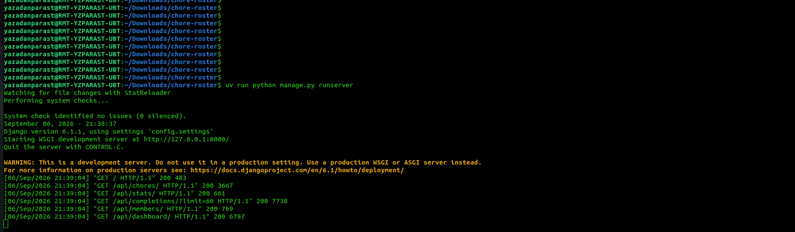

```
"GET /                        HTTP/1.1" 200   483
"GET /api/chores/             HTTP/1.1" 200  3667
"GET /api/stats/              HTTP/1.1" 200   661
"GET /api/completions/?limit=60 HTTP/1.1" 200 7738
"GET /api/members/            HTTP/1.1" 200   769
"GET /api/dashboard/          HTTP/1.1" 200  6797
```

This is the architecture proving itself. The first line serves the SPA shell — a tiny
**483-byte** HTML document containing nothing but a `<div id="root">` and two asset
tags. Everything else is **JSON fetched by JavaScript**: the five API calls fire
concurrently from a single `Promise.all()` in `refresh()`, which is why they share the
same timestamp.

Because the shell carries no data, switching between Dashboard, Chores, Members,
History and Stats triggers **no further requests** — the state is already in memory and
the views re-render instantly from it. New requests only happen when data actually
changes, e.g. clicking **Done** issues a `POST` followed by one refresh cycle.

---

## Project structure

```
chore-roster/
├── config/                     # Django project package
│   ├── settings.py             # ← the app is registered here, in INSTALLED_APPS
│   ├── urls.py                 # includes chores.urls at the root
│   ├── wsgi.py / asgi.py
├── chores/                     # the application
│   ├── models.py               # Member, Chore, Completion
│   ├── serializers.py          # DRF serializers + action payload validators
│   ├── api.py                  # ViewSets + dashboard/stats function views
│   ├── urls.py                 # DRF router + SPA entrypoint
│   ├── admin.py                # admin registrations with list/filter config
│   ├── tests.py                # 26 tests: models + API
│   ├── migrations/
│   └── management/commands/
│       └── seed.py             # demo-data generator
├── frontend/                   # served as static files by Django
│   ├── app.js                  # SPA: state, views, API client, event handling
│   └── styles.css              # dark theme, responsive, no framework
├── templates/
│   └── index.html              # SPA shell (the only template — the API is JSON-only)
├── docs/screenshots/           # walkthrough images used by this README
├── _docs/
│   └── plan.md                 # the spec produced in Question 2
├── backlog.md                  # the task backlog produced in Question 4
├── ANSWERS.md                  # homework answers
├── requirements.txt / pyproject.toml
├── .gitignore
└── manage.py
```

---

## Data model

```
Member                          Chore                              Completion
──────                          ─────                              ──────────
id                              id                                 id
name                            name                               chore        → Chore  (CASCADE)
email                           description                        completed_by → Member (SET_NULL)
color        (auto-assigned)    recurrence   daily|weekly|         completed_at (auto)
is_active                                    biweekly|monthly      note
created_at                      assignment_mode  rotate|keep       points_awarded
                                assigned_to  → Member (SET_NULL)   was_late
  1 ──────────────────────< ∞   difficulty   1–5
                                due_date
                                is_active
                                created_at
                                     1 ──────────────────────< ∞
```

**Derived properties** (exposed through the API, never stored):

- `Member.points` — sum of `points_awarded` across their completions
- `Member.initials`, `Member.completion_count`, `Member.open_chore_count`
- `Chore.points` — `difficulty × 10`
- `Chore.days_until_due`, `Chore.status` — `overdue` / `today` / `soon` (≤3 days) / `upcoming`

`Completion` is an **append-only log**: it's exposed read-only over the API and is only ever written by `Chore.mark_done()`.
It stores `points_awarded` as a snapshot, so re-rating a chore's difficulty later doesn't rewrite history.

---

## Core rules

All the interesting behaviour lives in `Chore.mark_done()`:

1. **Log** a `Completion` for the *current* assignee, snapshotting the points and whether it was late.
2. **Advance the due date** by the recurrence interval — and if the chore was so overdue that one step still lands in the
   past, keep stepping until the new due date is today or later. (A daily chore ignored for 10 days doesn't come back
   9 days overdue.)
3. **Rotate the assignee** to the next *active* member, wrapping around the list. Inactive members are skipped
   automatically. Chores set to `assignment_mode="keep"` stay with the same person forever.
4. Edge case: with **zero members**, the chore simply stays unassigned rather than crashing.

Each of these rules has a dedicated test.

---

## REST API reference

Base URL: `/api/`. All responses are JSON. No auth in v1 — a household shares one instance.

### Members

| Method | Endpoint | Description |
|---|---|---|
| `GET` | `/api/members/` | List members. `?active=true` filters to active only. |
| `POST` | `/api/members/` | Create. Body: `{"name": "Ana", "email": "ana@home.local"}` |
| `GET` | `/api/members/:id/` | Retrieve one |
| `PATCH` | `/api/members/:id/` | Partial update |
| `DELETE` | `/api/members/:id/` | Remove |

### Chores

| Method | Endpoint | Description |
|---|---|---|
| `GET` | `/api/chores/` | List. Filters: `?active=true`, `?member=<id>`, `?status=overdue` |
| `POST` | `/api/chores/` | Create |
| `GET/PATCH/DELETE` | `/api/chores/:id/` | Retrieve / update / delete |
| `POST` | `/api/chores/:id/done/` | **Mark done.** Body (optional): `{"note": "...", "completed_by": <id>}` |
| `POST` | `/api/chores/:id/snooze/` | Push the due date. Body: `{"days": 1}` (1–30) |

### Completions & aggregates

| Method | Endpoint | Description |
|---|---|---|
| `GET` | `/api/completions/` | Read-only history. Filters: `?member=<id>`, `?limit=n` |
| `GET` | `/api/dashboard/` | Everything the home screen needs in one round-trip |
| `GET` | `/api/stats/` | Per-member and per-chore aggregates + late rate |

### Examples

```bash
# create a member
curl -X POST localhost:8000/api/members/ \
  -H 'Content-Type: application/json' -d '{"name":"Ana","email":"ana@home.local"}'

# create a weekly, difficulty-3 chore due today
curl -X POST localhost:8000/api/chores/ \
  -H 'Content-Type: application/json' \
  -d '{"name":"Vacuum","recurrence":"weekly","difficulty":3,"assigned_to":1,"due_date":"2026-09-07"}'

# mark it done — rotates the owner and rolls the date
curl -X POST localhost:8000/api/chores/1/done/ \
  -H 'Content-Type: application/json' -d '{"note":"under the couch too"}'
```

<details>
<summary><code>POST /api/chores/1/done/</code> response</summary>

```json
{
  "completion": {
    "id": 12, "chore": 1, "chore_name": "Vacuum",
    "completed_by": 1, "member_name": "Ana", "member_color": "#5b8cff",
    "completed_at": "2026-09-07T14:02:11Z",
    "note": "under the couch too", "points_awarded": 30, "was_late": false
  },
  "chore": {
    "id": 1, "name": "Vacuum", "recurrence": "weekly",
    "recurrence_display": "Weekly", "assigned_to": 2,
    "assigned_to_name": "Ben", "assigned_to_color": "#ff8f5b",
    "difficulty": 3, "points": 30,
    "due_date": "2026-09-14", "days_until_due": 7,
    "status": "upcoming", "is_active": true
  }
}
```
</details>

<details>
<summary><code>GET /api/dashboard/</code> response shape</summary>

```json
{
  "buckets": { "overdue": [...], "today": [...], "soon": [...], "upcoming": [...] },
  "leaderboard": [ { "id": 1, "name": "Ana", "points": 180, "initials": "A", ... } ],
  "recent": [ { "chore_name": "Dishes", "member_name": "Ben", "was_late": true, ... } ],
  "stats": {
    "total_chores": 10, "overdue": 2, "due_today": 2,
    "members": 4, "completed_this_week": 36, "points_this_week": 820
  }
}
```
</details>

**Validation & errors** — invalid payloads return `400` with per-field messages (e.g. `difficulty` outside 1–5).
Unknown IDs return `404`. Writing to `/api/completions/` returns `405`, since history is append-only via `done`.

---

## Frontend

`frontend/app.js` is ~250 lines of dependency-free JavaScript organised as a tiny render loop:

- **`state`** — a single plain object (`view`, `dash`, `chores`, `members`, `completions`, `stats`, `modal`).
- **`refresh()`** — fetches all endpoints in parallel with `Promise.all`, updates state, re-renders.
- **`render()`** — rebuilds `#root` from state; each screen is a pure `state → HTML string` function.
- **One delegated click handler** on `document` reads `data-*` attributes (`data-view`, `data-done`, `data-edit`…),
  so no listeners need rebinding after a re-render.
- **`esc()`** escapes every interpolated value, and the CSRF token is read from the cookie for write requests.

`frontend/styles.css` is a hand-written dark theme using CSS custom properties, CSS grid, and a mobile breakpoint at
860px that collapses the sidebar into a horizontal nav bar. Toasts, modals and the bar charts are all pure CSS.

---

## Testing

```bash
uv run python manage.py test              # all 26 tests
uv run python manage.py test chores       # just this app
uv run python manage.py test chores.tests.APITests -v 2   # one class, verbose
```

```
Ran 26 tests in 0.100s

OK
```

**Coverage by area**

| Group | Tests |
|---|---|
| `MemberModelTests` | initials, defaults/auto colour, points aggregation |
| `ChoreModelTests` | points scale with difficulty · the four status buckets · completion is logged with correct points · late flagging · due-date advance for **every** recurrence · overdue catch-up · rotation cycles all members · `keep` mode doesn't rotate · inactive members are skipped · snooze · zero-member safety |
| `APITests` | list/create members · create chore · **invalid difficulty rejected (400)** · `done` rotates + logs · `snooze` · `PATCH` · `DELETE` · filter by member · dashboard payload shape · stats aggregation · completions are read-only (405) · SPA shell is served |

---

## Management commands

```bash
# wipe and regenerate a demo household: 4 members, 10 chores, ~36 completions
uv run python manage.py seed --fresh

# seed only if the database is empty
uv run python manage.py seed
```

The seeder uses a fixed random seed, so the demo data is reproducible. It deliberately includes overdue chores and some
late completions so the dashboard, leaderboard and late-rate stat all have something to show.

---

## Django admin

```bash
uv run python manage.py createsuperuser
uv run python manage.py runserver
# → http://127.0.0.1:8000/admin/
```

All three models are registered with tuned list displays, filters and search, so you can inspect or fix data directly.

---

## Configuration

Everything lives in `config/settings.py`. The things you'd change for a real deployment:

| Setting | Dev value | Production |
|---|---|---|
| `DEBUG` | `True` | `False` |
| `SECRET_KEY` | hardcoded | read from an env var |
| `ALLOWED_HOSTS` | `["*"]` | your domain |
| `CORS_ALLOW_ALL_ORIGINS` | `True` | swap for `CORS_ALLOWED_ORIGINS = [...]` |
| `DATABASES` | SQLite | Postgres via `dj-database-url` |
| static files | `STATICFILES_DIRS` → `frontend/` | `collectstatic` + WhiteNoise/CDN |

---

## Homework answers

| # | Question | Answer |
|---|---|---|
| 1 | Which coding agent? | Arena.ai Agent Mode — an agent that edits files and runs commands directly in the repo |
| 2 | Features the spec settled on | (1) household members, (2) chore catalog with recurrence + difficulty + assignee, (3) mark-done that logs a completion, awards points, rotates the assignee and rolls the due date, (4) dashboard with leaderboard, history and fairness stats |
| 3 | File to edit to include the app | **`settings.py`** — add the app to `INSTALLED_APPS` |
| 4 | Task 1 in `backlog.md` | *"Set up the Django project skeleton"* — create the `config` project and `chores` app, register `chores` in `INSTALLED_APPS`, wire `config/urls.py`, add the SPA shell template, verify `migrate` and `runserver` |
| 5 | Start the dev server | **`uv run python manage.py runserver`** |
| 6 | Run the tests | **`uv run python manage.py test`** |

---

## The AI-native workflow used

The point of the homework isn't the app — it's the process. What it looked like here:

1. **Vague idea → spec.** Brainstormed one question at a time with a chat assistant, choosing scope deliberately
   (rotation *yes*, authentication *no*), and saved the outcome to [`_docs/plan.md`](_docs/plan.md).
2. **Spec → backlog.** Fed the plan back to the agent and asked for a small, ordered set of tasks. Result:
   [`backlog.md`](backlog.md), six tasks, each one shippable on its own.
3. **Backlog → code, one task at a time.** *"Implement task #1 from backlog.md"*, review the diff, commit, repeat.
   Small steps keep the agent honest and the git history readable.
4. **Tests last, but not optional.** Asked the agent which scenarios *mattered* before letting it write anything —
   that conversation is what surfaced the overdue-catch-up and inactive-member edge cases, which are now both tested.

**Lesson learned:** the quality of the spec set the ceiling on everything after it. Ten extra minutes deciding that
chores should *rotate* (rather than be statically assigned) is what produced the rotation logic, the leaderboard and
the fairness stats — none of which were in the original one-line prompt.

---

## Roadmap

- [ ] Accounts & login, so each housemate sees their own view
- [ ] Multi-household support (one instance, many rotas)
- [ ] Email / push reminders for chores due tomorrow
- [ ] Swap requests — "can anyone take my Thursday?"
- [ ] Recurring-schedule exceptions (holidays, someone's away)
- [ ] Postgres + Docker Compose, and a CI workflow running the test suite

---

## Troubleshooting

| Symptom | Fix |
|---|---|
| `ModuleNotFoundError: rest_framework` | `uv pip install -r requirements.txt` |
| Page loads but is empty / "Could not reach the API" | Check the browser console; make sure the server is on the same origin you loaded the page from |
| `no such table: chores_chore` | `uv run python manage.py migrate` |
| Styles missing | `DEBUG` must be `True` in dev, or run `collectstatic` |
| Want a clean slate | `rm db.sqlite3 && python manage.py migrate && python manage.py seed --fresh` |

---

## License

MIT — do whatever you like with it.

*Built as coursework for the [AI Dev Tools Zoomcamp](https://github.com/DataTalksClub/ai-dev-tools-zoomcamp) by DataTalks.Club.*
