# TableTurn — Illustrated Build Guide

## Video Demo

[Screencast from 09-14-2026 08:39:33 PM.webm](https://github.com/user-attachments/assets/dabfd92b-cd24-4def-b3a0-be43abcf39fa)


How to build this project from nothing, with an AI coding agent, in the order
that makes each step checkable. Every phase ends in a **verification gate**: a
command you run before you're allowed to continue. Screenshots in
`guide-images/` are real output from a real run of this guide on Ubuntu —
including two that document a mistake, because a guide that only shows green
output teaches you nothing about red.

> **Status: verified end-to-end on a real machine.** Every gate in this guide
> has been executed and screenshotted on Ubuntu 22.04 / GNOME (uv 0.9.5, Node
> v22.22.3, npm 10.9.8, git 2.34.1): 66 backend tests, 32 frontend tests,
> ruff + eslint + tsc clean, production build, CORS preflight, the
> kill/restart persistence proof, and an 80-second demo video recorded with
> the GNOME built-in recorder. Where this guide says "expect", someone really
> saw it.

**How to read it:** phases run in order; gates are mandatory; prompts are
copy-pasteable. Two tracks exist:

| Track | Where | Purpose |
| --- | --- | --- |
| **Build** (this guide) | a fresh directory | produce the app yourself |
| **Reference** | the delivered repo | answer key; compare structure, not text |

Never run scaffold commands (`npm create vite`, `uv init`) inside a finished
project. Appendix A shows exactly what happens when you do.

| Phase | Homework Q | Deliverable | ~Time |
| --- | --- | --- | --- |
| 0 | — | toolchain | 10 min |
| 1 | Q1, Q2, **Q3** | repo + `_docs/specs.md` + first commit | 40 min |
| 2 | — | `openapi.yaml` | 30 min |
| 3 | **Q5** | backend, tests-first, mock store | 90 min |
| 4 | **Q4** | frontend prototype, mocked API | 90 min |
| 5 | **Q6** | frontend ↔ backend wired | 30 min |
| 6 | **Q7** | mock store → SQLite | 60 min |
| 7 | — | docs, demo video, submission | 45 min |

---

## Phase 0 — Toolchain

```bash
curl -LsSf https://astral.sh/uv/install.sh | sh
source $HOME/.local/bin/env        # or open a new terminal

uv --version                       # 0.9+ is fine; 0.12+ preferred
node -v                            # 20.19+ or 22.12+
npm -v
git --version
```

**Gate:** all four print versions.

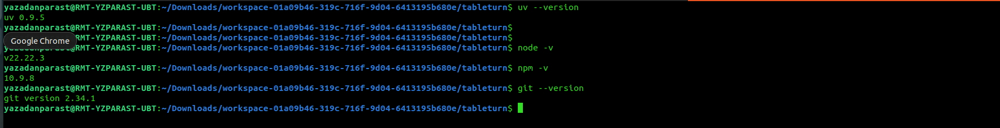
*The gate passing on the reference machine. Node 22 satisfies Vite 8; note npm
10.9.8 — the arborist bug below was observed on 10.8.x **and** 10.9.x.*

### Pitfalls

- **Node version matters.** Vite 8 needs `^20.19.0 || >=22.12.0`. Older Node dies
  with syntax errors, not a version message.
- **npm arborist bug** — `Cannot read properties of null (reading 'edgesOut')`
  while resolving `vitest@5`'s peer set. Pin `"vitest": "^4.1.0"`, and prefer
  `npm ci` (installs from the lockfile, skipping the buggy resolution path).

---

## Phase 1 — Repo + spec → Q1, Q2, Q3

### 1.1 Create the repo

```bash
# GitHub: empty repo named "tableturn" (no README, no .gitignore)
git clone git@github.com:<you>/tableturn.git && cd tableturn
mkdir -p _docs docs backend/app frontend tests
```

### 1.2 Generate the spec with a chat assistant

```text
I'm building a restaurant waitlist manager as a learning project. Help me write
a product spec before any code exists.

Interview me first: ask about the users, the core flow, the data model, and
what should be explicitly out of scope. Ask a few questions at a time and wait
for my answers.

Then produce a markdown spec with these sections:
1. Problem  2. Goals  3. Non-goals (be aggressive)  4. Users
5. Domain model (every field, type, nullability)
6. Business rules — NUMBER THEM R1, R2, R3… so tests can cite them
7. User stories with Given/When/Then acceptance criteria
8. API surface (method, path, purpose, success code)
9. Frontend behaviour  10. Persistence  11. Testing strategy  12. Definition of done

Stack is fixed: React+TypeScript+Vite frontend, FastAPI backend, SQLite via
SQLAlchemy, openapi.yaml as the contract. Also suggest 4 candidate names.
```

Numbered rules are the whole ballgame: tests cite them, comments cite them, and
"this breaks R5" is an argument-ender where "that's not what I meant" is not.

### 1.3 Review it yourself — reject the first draft if any of these fail

- [ ] Ordering and wait estimates **deterministic**? (ref: `position` = 1-based
  index by `created_at` then `id`; estimate = `(position − 1) × 10` min)
- [ ] Every status transition drawn? (`waiting → seated → completed`, `waiting → cancelled`)
- [ ] Every "what if" answered? too-small table · occupied table · delete seated
  party · cancel seated party · shrink table under its occupants (→ R3, R6, R7, R8)
- [ ] Non-goals real? auth, SMS, reservations, multi-venue, WebSockets — out, in writing
- [ ] Timestamps specified? (ref: UTC, ISO-8601 with `Z` → R10; this one rule
  prevents a genuine SQLite bug in Phase 6)

Save as `_docs/specs.md`.

### 1.4 AGENTS.md, then 1.5 .gitignore + README stub

```text
Based on _docs/specs.md, write AGENTS.md: the rules an AI coding agent must
follow in this repo. Include: sources of truth in priority order (spec,
openapi.yaml, tests); hard architectural rules (where HTTP calls live, where
business rules live, what must never import what); style rules; the exact
commands to run/test/lint; a definition of done; "known traps".
```

Then hand-edit it. Rules earned by pain stick: *no `fetch` in components, no
business rules in routes, no SQLite-specific SQL, inject the clock.*

### 1.6 Commit → **Q3**

```bash
git add _docs/specs.md .gitignore README.md AGENTS.md
git commit -m "Add product spec, README, AGENTS.md and .gitignore"
git push -u origin main
git rev-parse HEAD        # ← 40-char sha1, your Q3 answer
```

**Gate:** a hash prints; the four files are on GitHub.

---

## Phase 2 — The OpenAPI contract, before either side exists

```text
Read _docs/specs.md. Write openapi.yaml (OpenAPI 3.1.0) at the repo root
implementing exactly the API surface in section 8.

Requirements:
- Every schema in components/schemas mirrors the domain model in section 5,
  field for field, with correct nullability.
- Computed fields (position, estimated_wait_minutes) documented with the rule
  number that defines them.
- ONE error shape: {"error": {"code": string, "message": string}} as an
  ErrorEnvelope schema, referenced by every 404 and 409 response.
- Explicit camelCase operationId on every operation.
- servers: [{url: http://localhost:8000}]
- No endpoints I didn't ask for. No auth.
```

**Gate:**

```bash
uv run --with pyyaml python -c "
import yaml
spec = yaml.safe_load(open('openapi.yaml'))
print(spec['openapi'], spec['info']['title'])
for path, item in spec['paths'].items():
    for method, op in item.items():
        if method in {'get','post','patch','delete'}:
            print(f'{method.upper():6} {path:38} {op.get(\"operationId\")}')
"
```

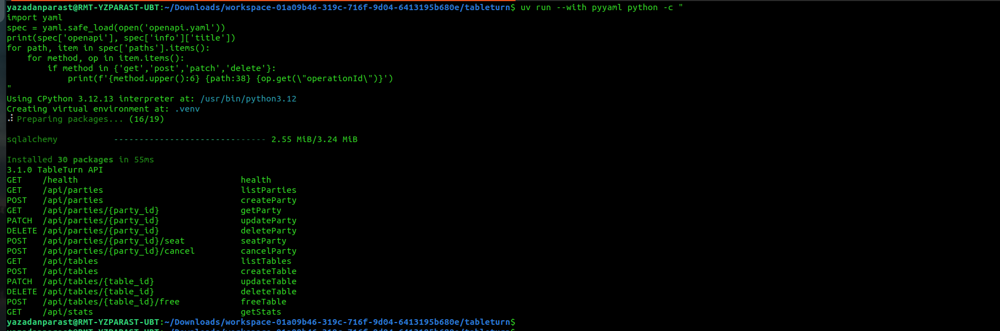
*The gate on the reference machine: 15 operations, every one with an
operationId, nothing extra. (`uv run --with pyyaml` builds a throwaway venv —
the "Installed 30 packages" noise is normal.)*

Decide now, retrofit never: one error envelope with machine-readable codes is
what lets the UI say *"Table T1 seats 2, but the party has 4 guests"* instead of
*"Error"*.

---

## Phase 3 — Backend, tests first → Q5

### 3.1 Initialise the uv project — **in a fresh directory only**

```bash
uv init --bare --name tableturn --python 3.12
uv add fastapi "uvicorn[standard]" sqlalchemy pydantic
uv add --dev pytest httpx pyyaml ruff
```

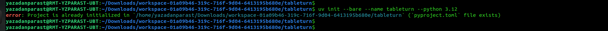
*`error: Project is already initialized in … (pyproject.toml file exists)`.
**This is correct behaviour, not a bug:** `uv init` is for an empty directory.
In a repo that already has `pyproject.toml`, skip it and go straight to
`uv add`.*

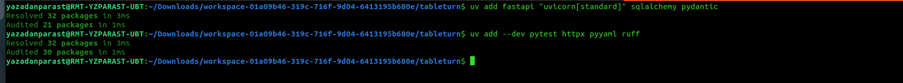
*`uv add` resolving 32 packages twice: runtime deps, then the dev group.*

Then two `pyproject.toml` settings, before any test exists:

```toml
[tool.uv]
package = false          # backend/ is a plain package dir, not a dist

[tool.pytest.ini_options]
testpaths = ["tests"]
pythonpath = ["."]       # else ModuleNotFoundError: backend
addopts = "-ra"
```

### 3.2 Skeleton + the layering rule

```text
backend/__init__.py  backend/app/__init__.py
backend/app/config.py    # env-driven Settings
backend/app/errors.py    # DomainError hierarchy
backend/app/schemas.py   # Pydantic mirrors of openapi.yaml
backend/app/store.py     # WaitlistStore protocol + implementation (THE RULES)
backend/app/api.py       # routes
backend/app/main.py      # create_app() factory
# models.py, database.py, seed.py arrive in Phase 6 — not yet
```

```
api.py     → HTTP translation only. No if-statements about business state.
store.py   → every rule R1–R10. Never imports fastapi.
schemas.py → shape only.
```

### 3.3 Tests BEFORE implementation — the phase must start red

```text
Read _docs/specs.md and openapi.yaml. Write pytest tests in tests/ for the
backend, BEFORE implementing it. One test per acceptance criterion, plus one
test per business rule R1–R10, citing the rule number in the docstring.

Provide tests/conftest.py with:
- a FakeClock class (deterministic now(), .advance(minutes=…)) so wait-time and
  average-wait tests never depend on wall-clock time
- a fixture building an isolated app per test — never a shared dev database
- helpers add_party(client, name, size) and add_table(client, name, capacity)

Use fastapi.testclient.TestClient. Assert status codes AND the error "code"
field, not just the message.
```

Run `uv run pytest` and **watch it fail**. Green-on-first-run means the agent
wrote implementation too; delete it and re-prompt. Then:

```text
Now implement backend/app/ to make those tests pass. Rules live in store.py.
Routes must contain no business logic. Raise DomainError subclasses from the
store; map them to HTTP in errors.py via an exception handler.
Use an in-memory dict-based store for now — we swap in SQLAlchemy later.
Do not create models.py or database.py yet.
```

**Gate:**

```bash
uv run pytest -q
uv run ruff check .
```

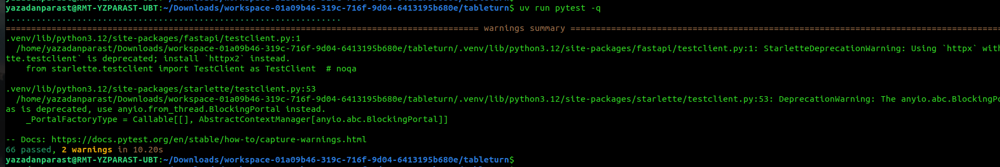
*The gate green. The two warnings are Starlette deprecations from
`fastapi.testclient` — noise, not failures.*


*Clean — after applying the B008 fix below.*

### 3.4 Prove the server actually runs

```bash
uv run uvicorn backend.app.main:app --reload --port 8000   # terminal 1
curl -s localhost:8000/health                               # terminal 2
curl -s -X POST localhost:8000/api/parties \
  -H 'Content-Type: application/json' -d '{"name":"Ava","party_size":4}'
```

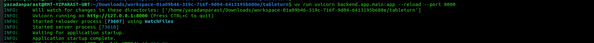
*In-process tests green ≠ server runs. This is the difference.*

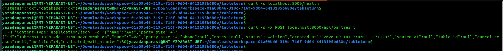
*`{"status":"ok","database":"ok"}`, then a created party: `position: 4`,
`estimated_wait_minutes: 30` — R1 and R2 observable over HTTP.*

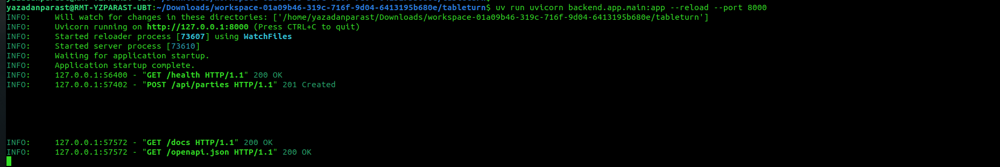
*The uvicorn access log confirming the curls — and someone opening `/docs`,
the free interactive API UI you get from FastAPI.*

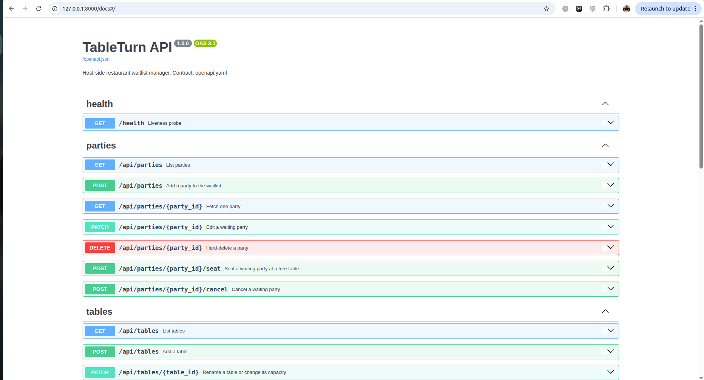
*And `/docs` itself: Swagger UI generated from the running app, listing the
same operations as `openapi.yaml`. If these two ever disagree, Phase 6's
contract test fails — that is the point of the contract test.*

### Q5 answer

```
uv run uvicorn backend.app.main:app --reload --port 8000
```

### Pitfalls

- **Ruff B008 flags every route.** `Depends()` in defaults *is* FastAPI's idiom:
  ```toml
  [tool.ruff.lint.flake8-bugbear]
  extend-immutable-calls = ["fastapi.Depends", "fastapi.Query", "fastapi.Path", "fastapi.Body"]
  ```
- **A wrong expectation is worse than no test.** Reference build's stats test
  asserted average wait `5`; correct was `25` (a forgotten clock advance). The
  implementation was right. Recompute by hand before touching code.
- **One error class per failure.** Blank name first raised
  `PartyNotWaitingError` — right family, wrong meaning. Codes are vocabulary.
- **`--reload` watches everything, including `node_modules`.** Run any `npm`
  command while uvicorn is up and WatchFiles restarts the server over files
  like `frontend/node_modules/flatted/python/flatted.py`:

  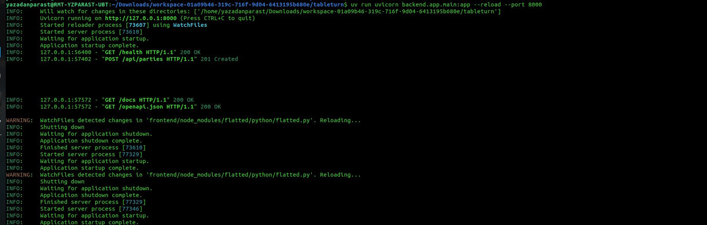
  *Harmless but noisy — and fatal if it fires mid-demo. Scope the watcher:
  `uv run uvicorn backend.app.main:app --reload --reload-dir backend --port 8000`.*

**Exit:** pytest green from red, ruff clean, curl returns JSON, and you can name
the file each of R1–R10 lives in.

---

## Phase 4 — Frontend prototype, mocked backend → Q4

### 4.1 Scaffold — read the warning first

> ### ⚠️ Two-trees rule
> `npm create vite` **inside an existing `frontend/` directory overwrites**
> `package.json`, `vite.config.ts`, `tsconfig*.json`, `eslint.config.js`,
> `index.html`, `src/main.tsx`, `src/App.tsx` — while keeping `src/api`,
> `src/components`, `src/hooks`, `src/lib` and the tests. The hybrid fails in
> four confusing ways at once. Appendix A is the autopsy with screenshots.
> In a delivered/finished repo: **skip 4.1 and run `cd frontend && npm ci`.**

In a fresh directory:

```bash
npm create vite@latest frontend -- --template react-ts
cd frontend && npm install
npm i -D "vitest@^4.1.0" jsdom @types/node        # quote the caret range
npm i -D @testing-library/react @testing-library/dom \
         @testing-library/jest-dom @testing-library/user-event
npm i -D eslint @eslint/js typescript-eslint globals
```

Delete template boilerplate (`src/App.css`, counter demo, logos). Replace
`vite.config.ts` and `tsconfig.json`:

```ts
/// <reference types="vitest/config" />
import react from "@vitejs/plugin-react";
import { defineConfig } from "vite";

const allowedHosts = process.env.VITE_DEV_ALLOWED_HOSTS;

export default defineConfig({
  plugins: [react()],
  server: {
    host: true,                 // bind 0.0.0.0, not just localhost
    port: 5173,
    ...(allowedHosts ? { allowedHosts: allowedHosts === "*" ? true : allowedHosts.split(",") } : {}),
  },
  test: {
    globals: true,
    environment: "jsdom",       // without this: "document is not defined"
    setupFiles: "./src/setupTests.ts",
    restoreMocks: true,
    env: { VITE_API_URL: "" },  // pin it so a stray .env.local can't move assertions
  },
});
```

`tsconfig.json` needs
`"types": ["vite/client", "node", "vitest/globals", "@testing-library/jest-dom"]`
— omit `"node"` and `process.env` in the config fails typecheck.

### 4.2 The API layer first, mocked — the structural decision that pays twice

```text
Read _docs/specs.md and openapi.yaml.

Create frontend/src/api/types.ts: interfaces mirroring every schema in
openapi.yaml, field for field, snake_case, correct null unions.

Create frontend/src/api/client.ts: the ONLY module allowed to talk to the
backend. One typed function per operation, named after its operationId.
For now implement them against an in-memory mock (module-level array +
setTimeout) so the UI is fully usable with no backend running.

Rules: no component may call fetch; no component may hardcode a URL; base URL
from import.meta.env.VITE_API_URL defaulting to http://localhost:8000, read
once; export an ApiError class carrying {status, code, message}.
```

```text
Implement the UI for _docs/specs.md section 9 using the client module.
Components: StatsBar, WaitlistPanel, AddPartyForm, PartyCard, FloorPanel,
AddTableForm, TableCard, SeatDialog, HistoryPanel, Toast.
- SeatDialog shows too-small/occupied tables DISABLED with the reason visible
  (mirrors R3 in the UI), not omitted.
- Poll parties/tables/stats every 5s; pause polling while a modal is open.
- Every failed request shows a toast with the server message. No silent failures.
- Loading and empty states for every list. No routing library. Single screen.
```

### 4.3 Frontend tests

```text
Write vitest + React Testing Library tests:
- src/lib/format.test.ts: pure formatting, incl. estimate 0, negative clock
  skew, null
- src/api/client.test.ts: stub global fetch; assert exact URL, method, JSON
  body, error-envelope parsing, 204 handling, network-failure path
- src/App.test.tsx: vi.mock the client module; assert list ordering, R2
  estimates, validation blocking a bad submit, seat dialog disabling too-small
  and occupied tables, unreachable-backend banner
```

`vi.mock("./api/client")` is *why* the API layer is one module: the whole UI
becomes testable with no server.

### 4.4 Gate

```bash
npx tsc --noEmit      # → clean
npx eslint .          # → clean
npx vitest run        # → 32 passed
npm run build         # → dist/ built
npm run dev           # click through with NO backend running
```

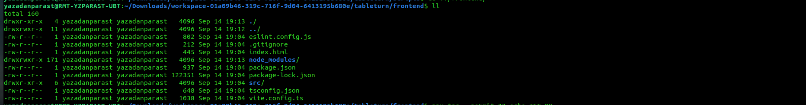
*The healthy tree after recovery: one `tsconfig.json` (no `tsconfig.app.json`),
the project's own 937-byte `package.json`, a 122 KB `package-lock.json`, and no
`.env.local`. Compare with the 711-byte impostor in Appendix A.*

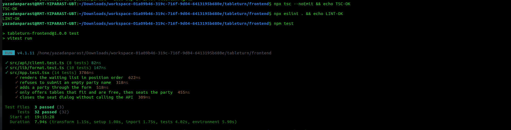
*All three frontend gates green: `tsc --noEmit`, `eslint .`, and 32 vitest
tests in three files — including "only offers tables that fit and are free,
then seats the party", the UI mirror of R3.*

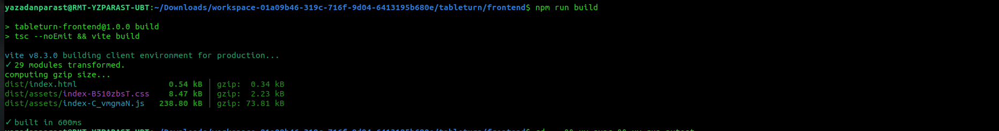
*Production build succeeds — the check people skip and graders don't.*

**Q4 answer:** `cd frontend && npm run dev`

### Pitfalls

- **State lifted too far.** `PartyCard` first took `reason` as a prop from the
  parent — choosing "Walked out" on one row changed every row. Per-row state
  belongs in the row.
- **TS can't narrow a lazy union.** `body as A | B` then `body.error` → TS2339.
  Use a guard: `function isRecord(v: unknown): v is Record<string, unknown> { return typeof v === "object" && v !== null; }`
- **`getByText` matches the whole element.** Notes render as `📝 {notes}`, so
  match with a regex.
- **Empty-string env vars.** `?? DEFAULT` keeps `""`. Use `raw?.trim() || DEFAULT`.

**Exit:** app fully clickable against the mock; all four checks pass.

---

## Phase 5 — Wire frontend to backend → Q6

```text
Replace the in-memory mock in frontend/src/api/client.ts with real fetch calls
against the same base URL. Keep every exported function signature identical so
no component changes.
- Content-Type: application/json
- handle 204 (no body)
- parse {"error":{code,message}} into ApiError; fall back to FastAPI's
  {"detail": …} for 422; fall back to the HTTP status otherwise
- wrap fetch in try/catch → ApiError(0, "network_error", …) so a dead backend
  shows a banner, not a stack trace
```

Identical signatures are the payoff for 4.2: **zero component changes.**

Backend CORS, in `create_app()`:

```python
app.add_middleware(
    CORSMiddleware,
    allow_origins=list(settings.cors_origins),  # default: localhost:5173 + 127.0.0.1:5173
    allow_credentials=True, allow_methods=["*"], allow_headers=["*"],
)
```

**Gate — check the preflight, not just the GET** (only non-simple requests
trigger it, so a passing GET proves nothing about POST):

```bash
curl -s -i -X OPTIONS http://localhost:8000/api/parties \
  -H "Origin: http://localhost:5173" \
  -H "Access-Control-Request-Method: POST" | grep -i access-control
```

Expect `access-control-allow-origin: http://localhost:5173` and POST among the
allowed methods. Then drive the UI for real and watch uvicorn's log.

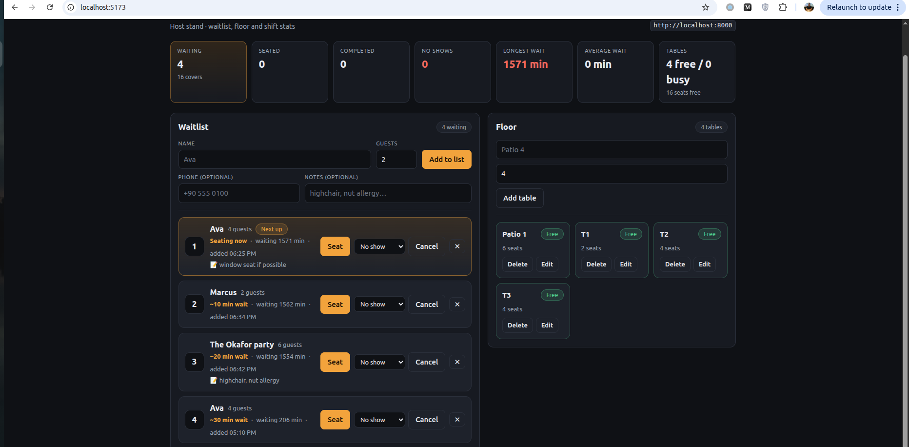
*Phase 5 proven: the UI renders real backend data — positions, estimates,
table capacities — with the API base URL badged top-right. Note the
"1571 min" waits: those are yesterday's parties, still in SQLite. Accidental
proof of Phase 6 before we reached it; `rm tableturn.db` before filming.*

**Q6 answer:** `http://localhost:8000` (override: `VITE_API_URL`; declared once
in `client.ts` and as `servers` in `openapi.yaml`).

**Pitfall:** Vite "Blocked request. This host is not allowed" → you're behind a
proxy; that's what `VITE_DEV_ALLOWED_HOSTS` is for.

---

## Phase 6 — Mock store → SQLite via SQLAlchemy → Q7

**(A) Homework-intended:** swap the dict store you built in Phase 3.
**(B) Shortcut:** SQLAlchemy from the start behind the protocol (what the
reference repo does). Recommend (A) once, to feel the seam.

```text
6.1  Add backend/app/models.py + database.py.
     SQLAlchemy 2.x declarative models matching openapi.yaml. UUIDs as
     String(36), datetimes as DateTime(timezone=True). GENERIC TYPES ONLY —
     Postgres must work by changing DATABASE_URL alone. Index
     (status, created_at, id): that is R1's ordering.
     database.py: Database class owning engine + sessionmaker,
     expire_on_commit=False; sqlite → check_same_thread=False; in-memory URL →
     StaticPool so tests share one connection.

6.2  Replace the in-memory store with SqlAlchemyStore implementing the SAME
     WaitlistStore protocol. Change NO route and NO test.
     Critical: SQLite returns NAIVE datetimes, Postgres aware ones. Normalise
     on read:
         def ensure_utc(dt):
             if dt is None: return None
             return dt.replace(tzinfo=timezone.utc) if dt.tzinfo is None else dt.astimezone(timezone.utc)
     That is what makes R10 (Z suffix) true on both engines.

6.4  Add tests/test_contract.py: load openapi.yaml, extract every
     (path, method, operationId), compare with app.openapi(); fail on drift in
     EITHER direction. This turns "the contract is the source of truth" from a
     claim into an enforced fact.

6.5  seed.py: demo rows only when the DB is empty and SEED_DEMO_DATA=true;
     create_all() from a lifespan hook; tests pass seed=False.
```

**6.3 is the lesson:** because routes depend on the *protocol* and tests build
the app via `create_app(database_url="sqlite://", seed=False, clock=fake)`, the
swap touches one file. If you're editing `api.py` here, the layering leaked —
fix the layering, don't push on.

**Gate:**

```bash
uv run pytest -q                 # the SAME tests, still green, zero edits
uv run ruff check .
cd frontend && npx vitest run && npx tsc --noEmit

# persistence proof — the thing a mock can never do:
curl -s -X POST localhost:8000/api/parties -H 'Content-Type: application/json' \
     -d '{"name":"Persistence Check","party_size":3}'
# Ctrl-C the backend, restart it, then:
curl -s localhost:8000/api/parties | grep -c "Persistence Check"   # expect 1
```

Real-world corollary from the reference run: the SQLite file survived an
overnight gap — parties added the previous evening still showed
`waiting 1571 min` in the UI the next day. Persistence you can observe
without restarting anything.

**Q7 answer:** `uv run pytest` (frontend `npm run test`; both `make test`).

### Pitfalls

- **Positions are computed, never stored.** Derive `position` and
  `estimated_wait_minutes` on every read; storing them makes every seat/cancel
  a renumbering bug-farm. R5 falls out for free when you compute.
- **Never keep two implementations of the rules.** The reference spec promised a
  `MemoryStore` "for fast tests" that was never written, because a second copy
  of R1–R10 *will* diverge — and the spec had to be corrected afterwards. A spec
  describing code that doesn't exist is worse than no spec.

---

## Phase 7 — Docs, demo, submission

1. **README.md** — a stranger can run it from a clean clone: prerequisites with
   versions, two-terminal quickstart, the Q4–Q7 commands in a table, how the
   frontend finds the backend, env-var table, layout, API summary, the rules a
   user notices, troubleshooting table.
2. **docs/ai-usage-report.md** — the deliverable most people phone in. Tools,
   actual phase order, what the agent got right, a table of what it got wrong
   (mistake → what caught it → fix), one false alarm, verification status, the
   habits that mattered.
3. **Makefile** — `install / run-backend / run-frontend / test / lint / build /
   clean-db`.
4. **Demo video** — next section.
5. **Submit:**
   ```bash
   uv run pytest -q                     # 66 passed
   cd frontend && npm run test          # 32 passed
   uv run ruff check .                  # clean
   cd frontend && npx eslint . && npx tsc --noEmit   # clean
   npm run build                        # builds
   git status                           # no node_modules/ .venv/ dist/ *.db
   ```
   Commit `uv.lock` and `frontend/package-lock.json` (reproducible installs for
   the grader), push, post your learning-in-public link, submit at
   `courses.datatalks.club/ai-dev-tools-2026/homework/hw2`.

---

# Recording the demo video

The homework asks for **30–90 seconds** showing: the main user flow, the same
data in two browsers, and data surviving a refresh. Plan it as five beats; each
beat proves a numbered rule, which is what makes it a *demo* and not a
screencast of clicking.

## Pick a recorder (Ubuntu)

Check your session type first — it decides which tools work:

```bash
echo $XDG_SESSION_TYPE     # x11 or wayland
```

**Option 1 — GNOME built-in (zero install, silent).** *Tested: the reference
demo for this course was recorded with exactly this.*
Press <kbd>Ctrl</kbd>+<kbd>Shift</kbd>+<kbd>Alt</kbd>+<kbd>R</kbd> to start; a
red dot appears; press again to stop. File lands in `~/Videos/` as
`Screencast from ….webm`. The <kbd>Print</kbd> key opens the same recorder with
full-screen/window/area selection. **No microphone** — plan on captions or a
voiceover added later. Perfectly acceptable for this homework.

**Option 2 — OBS Studio (mic + window capture, best quality).**

```bash
sudo apt install obs-studio        # or: sudo snap install obs-studio
```

Settings that matter: *Settings → Video*: base 1920×1080, output same, 30 fps.
*Settings → Output → Recording*: path `~/Videos`, format **mp4** (or mkv, then
*File → Remux* to mp4). *Sources*: `+` → **Screen Capture** (whole desk) or
**Window Capture** (just the browser); `+` → **Audio Input Capture** for your
mic. Do a 10-second test recording and *watch it back* before the real take.

**Option 3 — ffmpeg from the terminal (X11 only).**

```bash
ffmpeg -video_size 1920x1080 -framerate 30 -f x11grab -i :0.0+0,0 \
       -f pulse -i default -c:v libx264 -crf 23 -c:a aac ~/Videos/demo.mp4
# stop with Ctrl-C
```

On Wayland use Option 1/2 (x11grab cannot see a Wayland compositor).

**Option 4 — Loom / browser extension.** Fastest path to a shareable link; the
homework explicitly names it. Downside: account + upload required.

## Prep checklist (5 minutes, saves the take)

- [ ] `rm -f tableturn.db` then start the backend → clean seed data on screen
- [ ] Both servers running; `http://localhost:5173` open and loaded **before** recording
- [ ] Browser zoom 125–150%; bookmarks bar hidden; other tabs closed
- [ ] Notifications off (GNOME: *Do Not Disturb* in the top-right menu)
- [ ] Terminal font enlarged; the two startup terminals tidied side by side
- [ ] A second window ready for beat 4 (incognito window counts as a second browser)
- [ ] Recorder tested for 10 s and played back
- [ ] Script beside you (below); practise once off-recording

## Shot list — 80 seconds

| Time | On screen | Action | Proves |
| --- | --- | --- | --- |
| 0:00–0:08 | terminal | `uv run pytest -q` → 66 passed; `npm test` → 32 passed | tests exist |
| 0:08–0:18 | two terminals + browser | start backend & frontend; open :5173; seeded list appears | it runs from the README |
| 0:18–0:32 | waitlist | add "Demo Party", size 5 → lands last with position + estimate | R1, R2 |
| 0:32–0:50 | seat dialog | open Seat; point at T1/T2 **disabled with reasons**; pick Patio 1; confirm | R3 |
| 0:50–0:58 | waitlist | remaining parties renumber to 1, 2… | R5 |
| 0:58–1:08 | floor | Turn table → party moves to Recent as Completed; stats bar updates | R6, R9 |
| 1:08–1:16 | two browsers | add a party in window B; it appears in window A without refresh | polling, spec §9 |
| 1:16–1:20 | both windows | refresh both → everything still there | SQLite |

End card: repo URL. If you speak, one sentence per beat is plenty; if not, the
rule tags above make good captions.

## One-take tips

- Jump-cut the typing: start each beat with the command already in the terminal
  history (↑ ↑ Enter) instead of typing it live.
- Keep the mouse still while talking; movement draws the eye off the point.
- If a beat fails mid-take, **stop and restart the beat**, not the video —
  trimming is cheaper than re-performing.

## Trim / convert afterwards

```bash
# cut 4s of fumbling off the start, end at 84s
ffmpeg -i ~/Videos/Screencast\ from\ *.webm -ss 4 -to 84 -c copy cut.webm
# webm → mp4 for YouTube/X
ffmpeg -i cut.webm -c:v libx264 -crf 23 -c:a aac tableturn-demo.mp4
```

## Publish

YouTube (unlisted is fine) and Drive accept `.webm` directly; X prefers mp4 —
use the convert command above. Paste the link into the submission's
*learning-in-public* field. The post template lives in
`homework-2-answers.md`.

Video can't be attached somewhere (chat, review tool, PR)? Send stills
instead — two or three frames prove framing and content:

```bash
ffmpeg -i ~/Videos/demo.webm -ss 20 -frames:v 1 frame-20s.png
ffmpeg -i ~/Videos/demo.webm -ss 55 -frames:v 1 frame-55s.png
```

**No microphone / don't want your voice on it?** Captions work. Or I can
synthesize a voiceover from the shot list and hand you an `.mp3` to lay under
the video — say the word.

---

# Appendix A — Incident report: the clobbered frontend

What happens when `npm create vite@latest frontend -- --template react-ts` runs
*inside* a finished `frontend/` (with "ignore files and continue"): the template
overwrites the seven config/entry files and keeps your source tree. You get a
hybrid that fails four ways at once.

| Symptom | Cause |
| --- | --- |
| `> frontend@0.0.0 build`, `tsc -b && vite build` | template `package.json` replaced the project's |
| `Cannot find module 'vitest'` | template has no vitest / testing-library / `@types/node` |
| `npx` fetches `vitest@5`, then `document is not defined` | vitest not a dependency; template `vite.config.ts` has no `test:` block → environment `node`, not `jsdom` |
| `react-hooks/set-state-in-effect` lint error | template eslint config includes eslint-plugin-react-hooks; the project's deliberately doesn't |

The evidence, from the real incident:

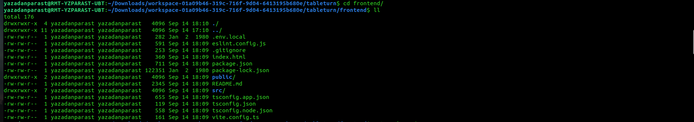
*`ll` inside the hybrid: `package.json` is 711 bytes (the template's), and
`tsconfig.app.json` / `tsconfig.node.json` exist — the project ships a single
`tsconfig.json`. The `.env.local` in this listing is a sandbox-only override
that should never have been there; it also leaked a preview URL into four test
failures.*

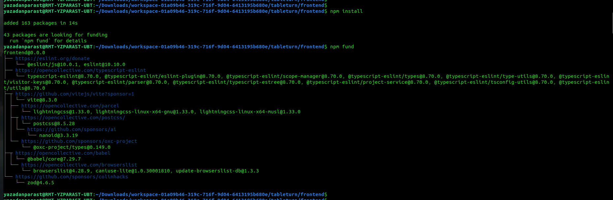
*`npm install` in the hybrid: the banner says `frontend@0.0.0` and installs 163
packages — the template's tree. The real project is named
`tableturn-frontend` and locks 220 packages including vitest 4.1.11.*

Cross-reference: `guide-images/03-phase3-uv-init-refused.png` is the same class
of mistake one phase earlier — a scaffold/init command aimed at a directory that
already had a project in it.

**Recovery:**

```bash
cd <repo root>
ls frontend/frontend 2>/dev/null && rm -rf frontend/frontend   # nested scaffold, if any
rm -rf frontend
tar xzf frontend-clean.tar.gz        # clean copy shipped with the workspace
rm -f frontend/.env.local
cd frontend && npm ci
grep -m1 '"name"' package.json       # must print: "name": "tableturn-frontend",
npx tsc --noEmit && npx eslint . && npm test && npm run build
```

**Prevention:** `scripts/verify-frontend.sh` fails loudly if `frontend/` has been
clobbered; the Phase 4.1 warning box exists because of this incident.

**Lessons worth keeping:** a scaffold command is a *write* command — check
`pwd` like you'd check a branch before pushing; and when four unrelated things
break at once, look for the one event that explains all four.

---

# Appendix B — Practice track

Rebuilding for learning, after the homework is submitted: clone the delivered
repo as a read-only reference, build in `~/practice/tableturn`, and compare
**structure** after each phase (does their `store.py` own R1–R10? is `fetch`
confined to one module?). `PRACTICE-RUNBOOK.md` is the checklist version.
Phase 3 must start red; Phase 6 must land with zero test edits. Those two
constraints are the entire module.

# Appendix C — Homework answers

| Q | Answer |
| --- | --- |
| 1 | Restaurant waitlist manager |
| 2 | `TableTurn` |
| 3 | your `git rev-parse HEAD` of the four-file commit |
| 4 | `cd frontend && npm run dev` |
| 5 | `uv run uvicorn backend.app.main:app --reload --port 8000` |
| 6 | `http://localhost:8000` |
| 7 | `uv run pytest` (frontend: `cd frontend && npm run test`; both: `make test`) |

Submission fields, reflection draft, and the learning-in-public post template:
`homework-2-answers.md`.

# Appendix D — Submission-night runbook

In order, about fifteen minutes:

| # | Do | Proof you're done |
| --- | --- | --- |
| 1 | `git rev-parse HEAD` | 40-hex string → **Q3** |
| 2 | `git ls-files \| wc -l`; `git ls-files \| grep -E 'uv.lock\|package-lock.json'` | ~56 tracked files; both lockfiles present |
| 3 | `uv run pytest -q` | `66 passed` |
| 4 | `cd frontend && npm run test` | `32 passed` |
| 5 | `uv run ruff check .`; `npx eslint .`; `npx tsc --noEmit`; `npm run build` | all clean |
| 6 | Push; make the repo **public** (the course is learning-in-public; the grader must be able to open it) | repo URL loads in a private browser window |
| 7 | Upload the demo (unlisted is fine); copy the link | link plays |
| 8 | Submit at `courses.datatalks.club/ai-dev-tools-2026/homework/hw2`: repo URL, Q1–Q7, video/learning-in-public link, time spent, one-sentence reflection | confirmation screen |

The reflection draft and post template are in `homework-2-answers.md`. Do not
submit before row 6: a perfect repo the grader cannot open scores zero.

---

## The five things

1. **Number your rules** (R1…R10) and cite them everywhere. Arguments become lookups.
2. **Contract before code**, with a test that fails on drift.
3. **One HTTP module, one rules module.** Those two seams made the Phase 5 and
   Phase 6 swaps one-file changes.
4. **Inject the clock.** Wait-time tests are flaky without it.
5. **Run the gate before moving on.** Every real mistake in this project hid
   from reading and showed up when executed.
