# HW4 Runbook — Order Tracker: DevOps & Observability for AI-Built Apps

Loop this module builds:
`change → observe user impact → alert with context → investigate from evidence
→ authorize a bounded response or escalate → verify recovery → audit`.
Stack: OpenTelemetry → Collector → Prometheus / Loki / Tempo → Grafana,
plus a responder service that launches a headless coding agent.
Principle: **the model may reason; the system must observe, authorize,
verify, and remember.**

Starter: `alexeygrigorev/order-tracker` (FastAPI + SQLite, compose, tests).
Key facts read from `app/main.py` on 2026-10-04:
- seeds: `standard-1001`, `express-1002` (created_at = previous month-end),
  `standard-1003`;
- `GET /api/orders/{id}` → 404 when absent; `order_detail()` adds
  `estimated_delivery` for express via `placed_at.replace(day=day+2)` —
  overflows the month ⇒ unhandled ValueError ⇒ 500 (the Q6 incident);
- `/healthz` returns `{"status":"ok"}`.

## Step 1 — run the app (Q1)

### Step 1 evidence (real run) + pitfalls

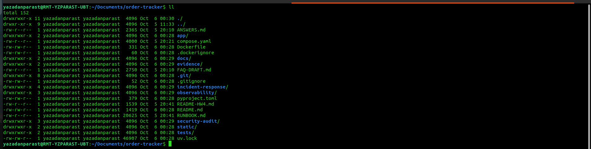
*`ll` in the repo root: `Dockerfile`, `app/`, `compose.yaml`, `observability/`,
`incident-response/`, `security-audit/` all present — one archive, no leftovers.*

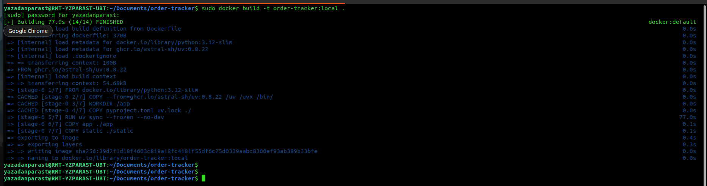
*`sudo docker build -t order-tracker:local .` → `[+] Building 77.9s (14/14) FINISHED`;
`uv sync --frozen` layer runs clean, new image sha written and tagged.*

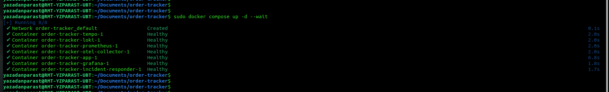
*`sudo docker compose up -d --wait` → tempo, loki, prometheus, otel-collector,
app, grafana, incident-responder — all `Healthy`.*

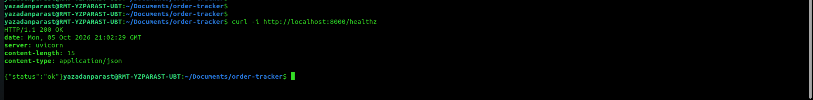
*`curl -i http://localhost:8000/healthz` → `200 OK`, body `{"status":"ok"}`. Q1 closed.*

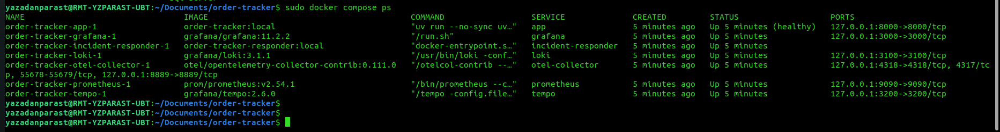
*`sudo docker compose ps` → app `(healthy)`, grafana, incident-responder, loki,
otel-collector, prometheus, tempo — all `Up`, ports 8000/3000/3100/4317-4318/
9090/3200/8889 published on 127.0.0.1.*

- **Pitfall #1 (real): Compose walked UP into the wrong project.** From a
  directory without a compose file, compose v2 searches parent dirs and found
  `~/docker-compose.yml` (an old `api-gw-base` stack), then failed with
  `failed to bind host port 0.0.0.0:80 … address already in use` — nothing to
  do with Order Tracker (which wants :8000). Remedy: `cd` where
  `compose.yaml` lives (nested clone!) and sanity-check with
  `docker compose config --services` (must print `app`) before any `up`.
- **Pitfall #2 (historical, HW3 #2 again): bridge-network DNS was dead inside
  `RUN uv sync` on the corporate network** — `files.pythonhosted.org … dns
  error: Try again`. Remedy then: build once with `docker build --network=host`
  plus proxy build-args, tag `order-tracker:local` (exactly what compose's
  `image:` line expects), then `docker compose up -d --wait` WITHOUT `--build`.
  The corporate proxy is no longer in use: builds now run plain
  `docker build -t order-tracker:local .` and every config in this repo is
  proxy-free.

## Step 2 — instrument one endpoint, console export (Q2)

Sandbox-verified 2026-10-04 (uv, no docker): starter tests `3 passed` with
instrumentation; live codes `standard-1001 → 200`, `standard-1002 → 404`,
`express-1002 → 500`; console metric `http.server.requests` carries
`http.method` / `http.route` (template) / `http.status_code` plus exemplars
with trace+span ids; structured log bodies `order lookup hit|missed`.
Two traps fixed on the way (keep in mind for docker logs too):
- the periodic metric reader flushed onto pytest's closed stdout ⇒ providers
  are shut down via `atexit`;
- console exporters write to `os.fdopen(os.dup(1))`, a dup of fd 1, so
  background threads never touch the stream pytest swaps per test.
Middleware records 500 for UNHANDLED exceptions before re-raising — the 5xx
alert (Q4) and the express incident (Q6) depend on exactly that.
Kit copies: `hw4-kit/q2/{app/telemetry.py, app/main.py, pyproject.toml, uv.lock}`.

### Step 2 evidence (real run)

*Frame 06 (`git status --short`: only the instrumented app files modified) pending capture — see the evidence manifest.*

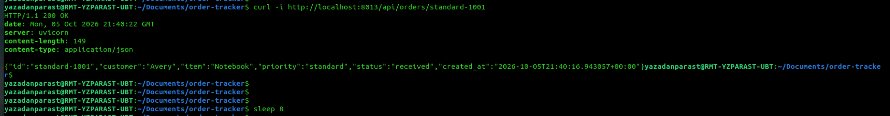
*`docker run -d --name ot-console -p 8013:8000 -e ORDER_DB_PATH=/tmp/orders.db
order-tracker:local` — no OTLP endpoint in this container, so the console
exporters stay active; `curl -i …/api/orders/standard-1001` → `200 OK` + the
seeded Avery/Notebook JSON; `sleep 8` lets the 5 s metric reader fire.*

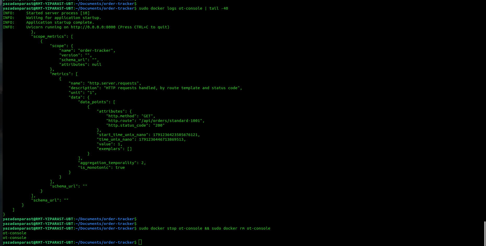
*`docker logs ot-console | tail -40` → the `resource_metrics` block: counter
`http.server.requests` ("HTTP requests handled, by route template and status
code"), one data point with `http.method: GET`, `http.route:
/api/orders/standard-1001`, `http.status_code: "200"`, `value: 1`, monotonic.
Route + status code in one metric point. Q2 closed: **200**.*

**Troubleshoot episode (v2 re-run) — the starter-image detour.** Symptom: the
first two `ot-console` runs printed uvicorn access lines but zero telemetry
JSON, even after `sleep 8`. Diagnosis: the identical probe in a clean sandbox
(image built from this repo's `app/`) emitted one `resource_metrics` block and
four span/log records — so the code was fine and the *image* was suspect;
`pyproject.toml` was 379 B and `uv.lock` 46 907 B (starter sizes; instrumented:
496 B / 58 262 B) and `grep -c opentelemetry pyproject.toml` printed `0`.
Root cause: the working tree still held starter app code, so the 21:02 image
was telemetry-free. Fix: extract the complete repo archive, rebuild (`uv sync`
layer uncached as the OTel deps enter), `compose up -d --wait`. Verification:
this frame pair — curl 200 on the instrumented image, then the metric JSON
above. Lesson: when telemetry vanishes, fingerprint the *image*, not just the
code — dependency-file byte sizes are a two-second lie detector.

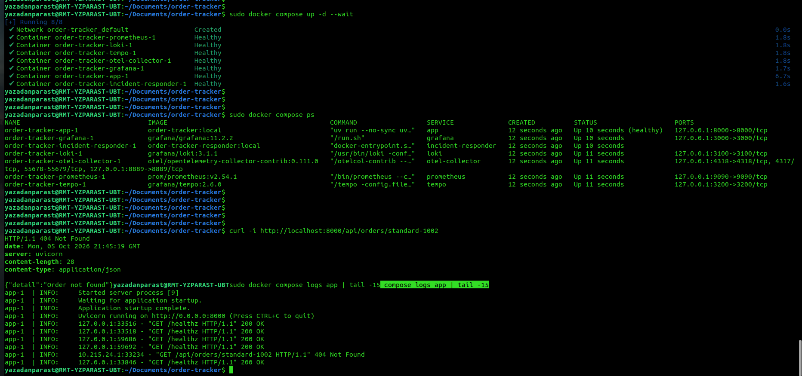
*One continuous shot: `sudo docker compose up -d --wait` → Running 8/8, all
seven containers Healthy on the instrumented app; the `compose ps` service
table; `curl -i …/api/orders/standard-1002` → `HTTP/1.1 404 Not Found` +
`{"detail":"Order not found"}`; and `docker compose logs app | tail -15` =
plain uvicorn access lines (404 included) — the telemetry JSON went to the
Collector, not stdout.*

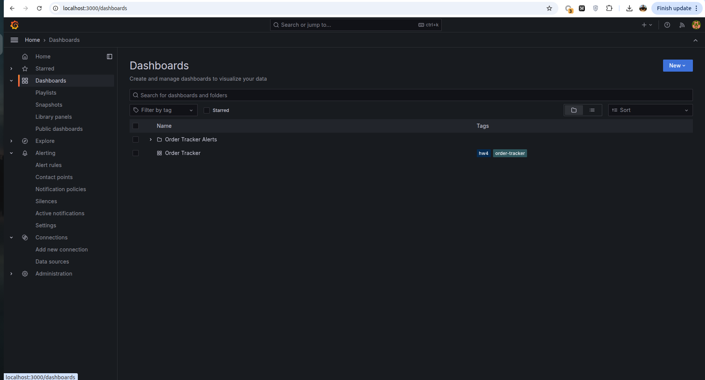
*`localhost:3000/dashboards`: provisioning placed the **Order Tracker**
dashboard (tags `hw4`, `order-tracker`) and the **Order Tracker Alerts**
folder — no manual clicks, configs live in `observability/`.*

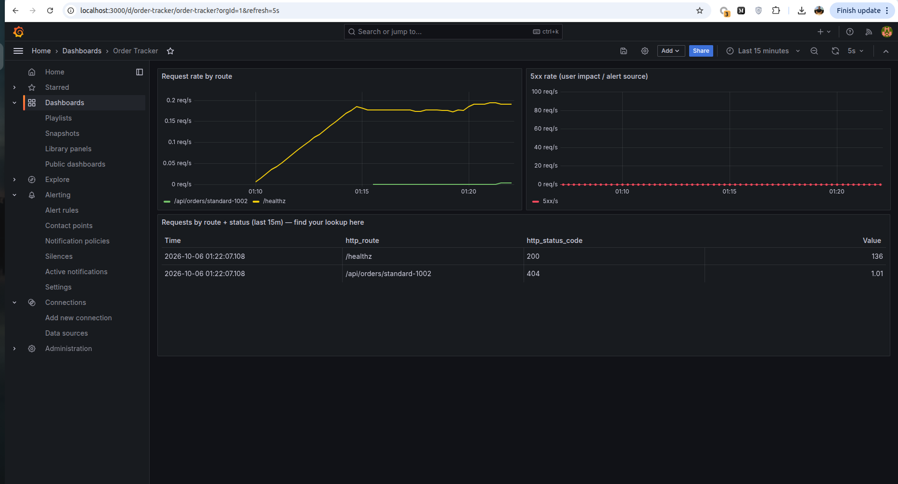
*Request rate by route: `/healthz` ~0.2 req/s plus the `/api/orders/standard-1002`
line; **5xx rate panel flat at 0**; table "Requests by route + status (last
15m)": `/healthz · 200 · 136` and `/api/orders/standard-1002 · **404** · 1.01`.
Logs/traces resolve through the provisioned Loki/Tempo datasources.
Q3 closed: **404**, visible in Grafana.*


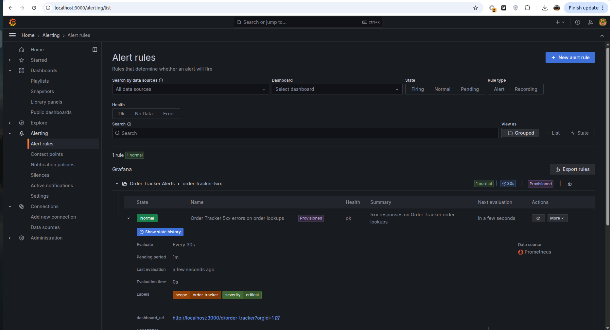
*After `curl -i .../standard-1002` (404, not 5xx) the rule evaluates to
**Normal** — Q4's answer. `noDataState: OK` absorbs the empty 5xx series, so
quiet periods never show "No data".*

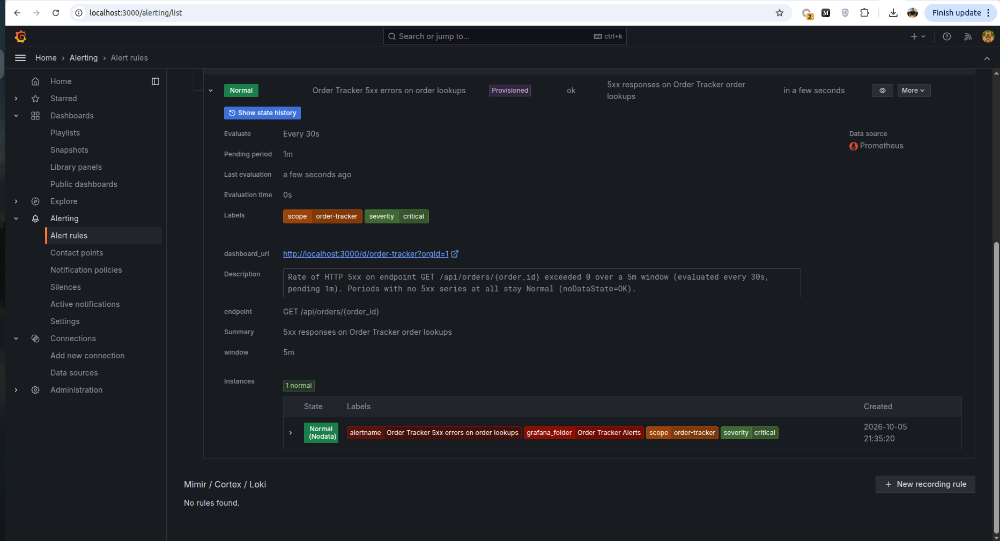
*Rule detail, lower half: the description states the 5 m window and "Periods
with no 5xx series at all stay Normal (noDataState=OK)"; `endpoint:
GET /api/orders/{order_id}`, `window: 5m`; Instances table: state
**Normal (Nodata)** carrying alertname + grafana_folder + scope/severity
labels — the quiet-period handling made visible. Q4 closed: **Normal**.*


## Step 5 — responder service + headless agent (Q5)

### 5.1 What was deployed

`hw4-step5.zip` (later refined by 5b/5c) dropped the whole `incident-response/`
tree into the repo plus an extended `compose.yaml`:

- `responder.py` — FastAPI on **:8001**: `POST /alerts` stores the raw payload
  (`alert.json`), collects evidence (`collect-evidence.sh` → Loki/Tempo/Prometheus),
  launches the headless coding agent with the rendered `responder-task.md` as prompt,
  and writes `response.json` (conforms to `response.schema.json`) including the
  agent's **last line**.
- `autonomy-policy.yaml` — the authorization boundary: may edit `app/*.py`,
  rebuild and restart the app; may **not** touch volumes, topology, credentials
  or git; `test=true` alerts are observe-only; no credentials ⇒ no agent.
- `runbooks/verify-recovery.sh` + `runbooks/rollback.sh`, `incidents/` audit store.
- compose service `incident-responder`: repo mounted at `/repo`, docker socket for
  post-fix restarts, credential env from the project `.env`.

Agent of choice (user vote): **GitHub Copilot CLI**, headless
`copilot -p "<task>" --allow-all-tools`.

### 5.2 Intended run sequence

```bash
export COPILOT_GITHUB_TOKEN=$(cat ~/.copilot-token)     # or .env channel, see T5-1
# responder sources live in incident-response/ (kit archive already extracted)
sudo docker build -t order-tracker-responder:local ./incident-response
sudo docker compose up -d --wait
curl -i http://localhost:8001/healthz                   # {"status":"ok"}
curl -i -X POST http://localhost:8001/alerts -H 'Content-Type: application/json' -d '{…ResponderTest test=true…}'
cat incident-response/incidents/<id>/response.json
tail -5 incident-response/incidents/<id>/agent-output.txt
```

### 5.3 Troubleshooting episodes (each one, in order of encounter)

**T5-1 — Agent skipped: "COPILOT_GITHUB_TOKEN not set", although it was exported.**
Symptom: POST returns `agent_last_line: null`; `response.json` →
`agent.status: skipped, reason: COPILOT_GITHUB_TOKEN not set`; no `agent-output.txt`
(incidents `…-f9bbb3`, later `…-09282e`).
Diagnosis: `sudo docker compose exec incident-responder printenv COPILOT_GITHUB_TOKEN`
empty. Root cause: compose ran under **sudo**, which strips the caller's environment,
so `${COPILOT_GITHUB_TOKEN:-}` interpolated to *empty* and the container was **created**
credential-less. Fix: keep the secret in the gitignored project `.env`
(`printf 'COPILOT_GITHUB_TOKEN=%s\n' "$…" > .env`, `.env` added to `.gitignore`
*first*) — compose reads `.env` from disk regardless of sudo — or pass explicitly:
`sudo COPILOT_GITHUB_TOKEN="$…" docker compose up -d`. Verification: printenv prefix
inside the container. Lesson → pitfall #4; this is also the autonomy gate working
(no authorization ⇒ no autonomous agent), kept as positive evidence.

**T5-2 — `Access denied by policy settings` from copilot (container and host).**
Symptom: smoke test `copilot -p "…PONG"` fails with the policy banner listing
org restriction / subscription / admin policy. Diagnosis: separated credential paths —
the host OAuth login (`copilot login`, browser device flow, "Signed in successfully")
versus the fine-grained PAT. Root cause (two layers): the PAT lacked the
**"Copilot requests"** permission (Copilot API answers 403, CLI renders it as policy
denial), and account-level Copilot access must be enabled at
`github.com/settings/copilot`. Fix: re-mint/edit the PAT with *Copilot requests: Read*
on the single repository; verify on the host **before** touching any file:
`COPILOT_GITHUB_TOKEN=$T copilot -p "…PONG"` → PONG (frame 36). Lesson: validate
credentials where the UI can see them before injecting them into infra.

**T5-3 — `401 Bad credentials` inside the container after rotating the PAT.**
Symptom: `Failed to fetch PAT user login (401): GitHub returned: Bad credentials`.
Diagnosis: host PONG worked (it used the *OAuth store*, not the PAT) while the
container used the PAT from `.env` — and that PAT string was dead on arrival
(rotation confusion). Root cause: containers keep the env they were **created** with;
writing `.env` afterwards changes nothing until recreate. Fix: recreate
(`sudo docker compose up -d --wait`) *and* adopt the verify-before-use checklist
(`curl -s -H "Authorization: Bearer $T" https://api.github.com/user` must print the
login). Lesson: a 401 on `/user` is always the token string, never scopes or proxy.

**T5-4 — `network fetch failed`: the corporate proxy refuses the bridge netns.**
Symptom: in-container copilot: `error sending request for url
(https://api.github.com/copilot_internal/user)`; diagnostics inside the container:
DNS ok, `curl -x http://192.168.70.135:3128 https://api.github.com/zen` →
`Connection refused`, while the identical connect from the host succeeds.
Root cause: proxy/forwarding path rejects TCP originating from the compose bridge
network (host netns is accepted). Fix (`hw4-step5b.zip`): responder gets
`network_mode: host`; evidence/verify scripts re-pointed to published
`127.0.0.1` ports (`localhost:3100/3200/9090/8000`); Grafana reaches the responder
via `extra_hosts: host.docker.internal:host-gateway` and the contact point URL
becomes `http://host.docker.internal:8001/alerts`. Verification: zen quote + later
PONG from inside the container. Trade-off documented (F-02): wider network reach,
bounded by the autonomy policy. Lesson → pitfall #5.

**T5-5 — Silent exit 1, empty `agent-output.txt`.**
Symptom: `agent.status: completed, exit_code: 1, last_line "(no output)"`; stderr
empty; copilot's own log (mounted store) needed `sudo cat`. Root cause: the OAuth
store was mounted **read-only**, but copilot's `session-store.db` is a SQLite
**WAL** database — authentication cannot open it without write access to `-wal/-shm`.
Fix: drop `:ro` from the mount (`sed -i 's|:/root/.copilot:ro|:/root/.copilot|'
compose.yaml`) + recreate. Lesson: stateful CLI stores need writable mounts; when a
CLI dies silently, read *its* log directory, not just stderr.

**T5-6 — `No authentication information found`: the keyring vault.**
Symptom: with the writable store mounted and no token env, copilot still sees no
credentials. Root cause: `copilot login` on a desktop stores OAuth in the **session
keyring**; `~/.copilot` held session state only. Containers have no keyring.
Fix (the pattern that closed Q5): run `copilot login` **inside the responder**
(`sudo docker compose exec incident-responder copilot login`); the device-flow
callback port binds on the host loopback *because of host networking*, so the host
browser completes it; accept `Store token in plaintext config file? y` → the store
lands in the mounted `/root/.copilot` and survives recreates. Companion responder
patch (`hw4-step5c.zip`): the launch gate accepts **token OR mounted OAuth store**
(`_copilot_credentials()`), recording which one as `agent.auth`. Lesson → pitfall #6;
full credential lifecycle in `security-audit/credentials-handling.md`.

**T5-7 — Green path (Q5 closed).**
In-container PONG (frame 39), then the homework test POST → incident
`20261005-103931-5db41b`, `agent.status: completed, auth: oauth-store`,
decision `observe-only / test notification`, and the verbatim last line:
`VERDICT: Test alert required no changes; the app is healthy and the health endpoint returned HTTP 200 via localhost.`
(frame 40). That line is the Q5 free-text answer.

**T5-8 — v2 re-run gate skip: the credential landed in the wrong file.**
Symptom: test POST accepted (`incident 20261005-223210-9a631e`, `test_mode:
true`) but `response.json` carries `agent.status: "skipped"`, reason "no
Copilot credentials (COPILOT_GITHUB_TOKEN or mounted OAuth store) — policy: no
authorization, no autonomous agent". Diagnosis: two drifts at once — (1) the
fresh fine-grained PAT (account permission **Copilot Requests: read-only**,
7-day expiry — least privilege by design) was pasted into `.env.example`, the
*tracked template*, via `sudo vim`, so compose's `${COPILOT_GITHUB_TOKEN}`
substitution stayed empty; (2) the host OAuth store had been recreated by a
new `copilot login` (run after `sudo chown -R "$USER:$USER" ~/.copilot`), so
the mounted store no longer matched the gate's check. Root cause: credential
channel confusion, not a responder defect — the gate enforced policy exactly.
Fix: token lives only in git-ignored `.env` (mode 600); `.env.example`
restored to empty placeholders and its ownership returned to the user;
`docker compose up -d --wait incident-responder` re-injects the env.
Verification: the re-POSTed test alert (22:55:17) opened incident
`20261005-225517-e6be87`; the agent ran on the **token** channel, exit 0 in
37 s, and answered `VERDICT: Synthetic test alert; no changes made, and app
health verified with HTTP 200.` (frames 17-18). Lesson: templates carry shapes, never values — a secret
typed into a tracked file is burned at save time; run `git status --short`
before and after touching anything credential-adjacent.

### 5.4 Step-5 evidence frames

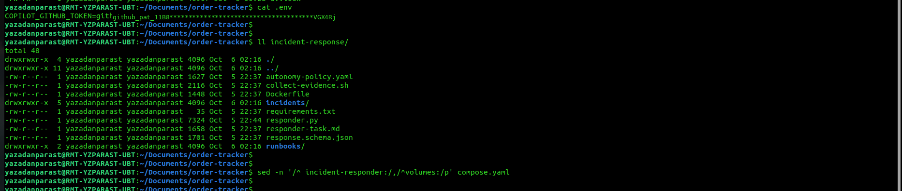
*`cat .env` with the PAT value black-boxed — the `github_pat_11B8…VGX4Rj`
stand-in is drawn over the original pixels, the frame stays and the secret
doesn't; the file itself is mode 600 and git-ignored — followed by
`ll incident-response/`: autonomy-policy.yaml, collect-evidence.sh,
Dockerfile, incidents/, requirements.txt, responder.py, responder-task.md,
response.schema.json, runbooks/ — the complete responder kit on disk.*

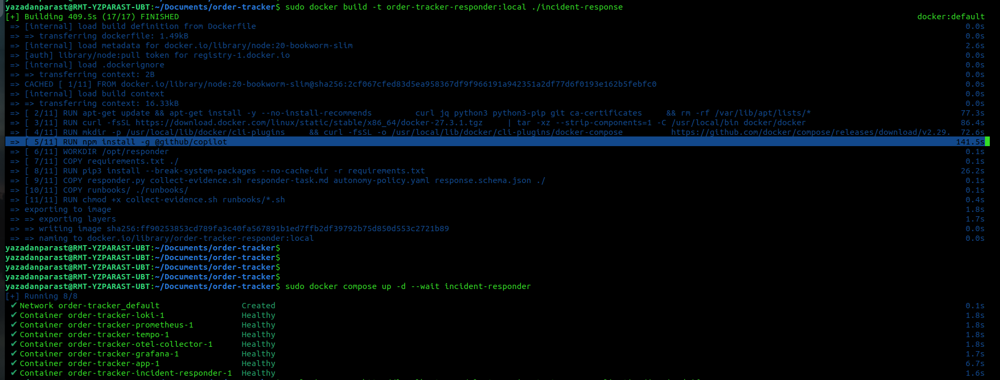
*`sudo docker build -t order-tracker-responder:local ./incident-response` →
`17/17 FINISHED`; layer 5/11 `RUN npm install -g @github/copilot` (141.5 s)
is the headless agent entering the image, between the docker-cli/compose
plugin layers and the python requirements layer; the subsequent
`compose up -d --wait` reports Running 8/8 with every service Healthy.*

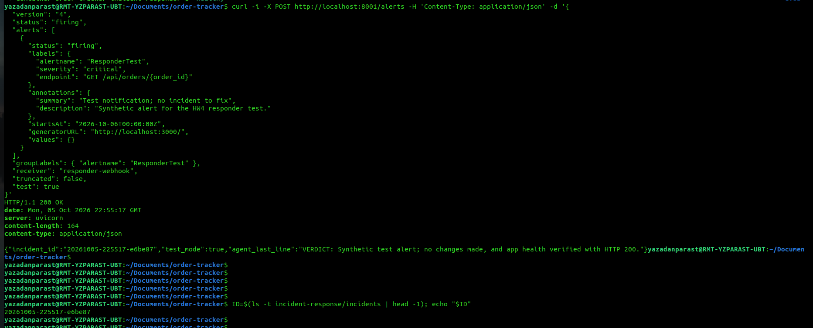
*The full ResponderTest payload (`test: true`) POSTed to `:8001/alerts` →
`HTTP/1.1 200 OK` + `{"incident_id":"20261005-225517-e6be87",
"test_mode":true,"agent_last_line":"VERDICT: Synthetic test alert; no changes
made, and app health verified with HTTP 200."}`; `ls -t incidents | head -1`
echoes the same id.*

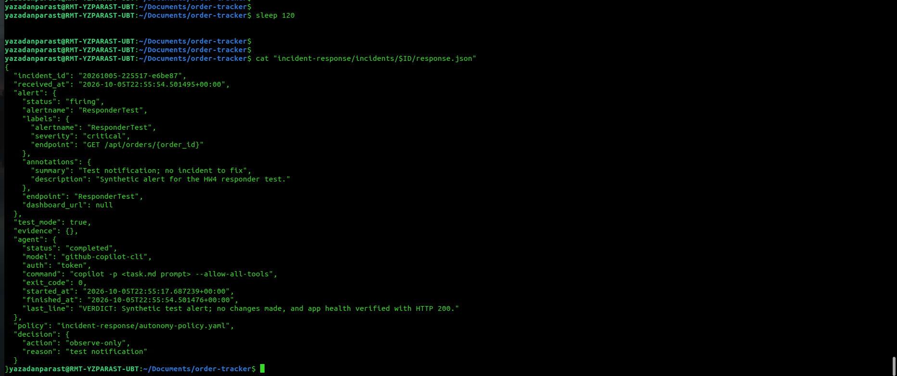
*Incident e6be87 in full: `test_mode: true`, `evidence: []` (observe-only by
policy), agent `github-copilot-cli`, auth `token`, command
`copilot -p <task.md prompt> --allow-all-tools`, exit 0, 22:55:17 → 22:55:54,
`last_line` = the Q5 free-text answer; decision `observe-only` because
"test notification".*

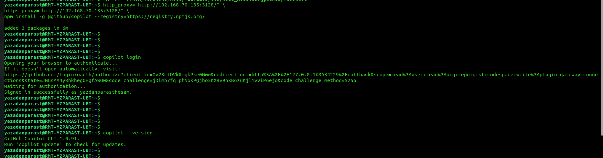
*Host side of the two-channel auth: `npm install -g @github/copilot`,
`copilot login` → "Signed in successfully as yazadanparasthesam." (the
interactive OAuth device flow that creates the store fallback), and
`copilot --version` → GitHub Copilot CLI 1.0.91.*

Frame 16 (responder service block via `sed -n '/^  incident-responder:/,
/^volumes:/p' compose.yaml` + `curl -i localhost:8001/healthz`) is pending
capture. Index: 14-env-hygiene+tree · 15-responder-build ·
16-block-healthz · 17-test-post · 18-response-verdict · 19-copilot-version
(all under `evidence/`, success path only; every failure above is documented
as prose + log lines).

### 5.5 Why `.env` works and `.env.example` never will

The responder's authorization rides on one compose.yaml line:

    environment:
      COPILOT_GITHUB_TOKEN: ${COPILOT_GITHUB_TOKEN:-}

When `docker compose up` runs, compose interpolates `${…}` from exactly two
places: the shell environment of the compose process, and a file named
precisely **`.env`** in the project directory (compose v2 auto-loads it;
`--env-file` can point elsewhere). Any other filename — `.env.example`,
`.env.template`, `secrets.txt` — is invisible to compose. It is not a config
channel at all; it is a **human convention**: a tracked, committed, value-free
shape of the real thing, so a fresh clone knows which keys to fill in.

So pasting the PAT into `.env.example` (episode T5-8) left the interpolation
empty: `${COPILOT_GITHUB_TOKEN:-}` expanded to its empty default, the responder
container started with `COPILOT_GITHUB_TOKEN=""`, and the launch gate —
correctly — reported "no Copilot credentials". Nothing was broken; the value
was simply parked where no tool looks.

The division of labour, and why gitignore is the linchpin:

| file | tracked by git? | carries | purpose |
|---|---|---|---|
| `.env.example` | yes — committed | key names + comments only | template: the *shape* of the config |
| `.env` | **no** — listed in `.gitignore` | real values, mode 600 | per-machine secrets and knobs |

`.gitignore` is what makes `.env` the safe place: git refuses to track it
(`git check-ignore -v .env` prints the matching rule; `git ls-files .env`
prints nothing), so secrets never reach a commit, a push or a GitHub upload —
while the file still sits next to compose.yaml where compose auto-loads it.
The template travels with the repo precisely because it carries no values;
the values stay home precisely because they do.

Two operational corollaries:

- Interpolation happens at **create** time. Editing `.env` changes nothing for
  a running container; the service must be recreated
  (`sudo docker compose up -d --wait incident-responder`) for the new value to
  enter its environment.
- Verify what interpolation actually produced with
  `sudo docker compose config | grep -A1 COPILOT` — it prints exactly what the
  container will see. Empty there means the gate will refuse later, no matter
  what any example file claims.

## Step 6 — Grafana webhook → real incident → agent fix → verify recovery (Q6)

### 6.1 The chain, end to end

metric (`http.server.requests` with route+status) → Prometheus (collector :8889) →
Grafana rule `order-5xx-rate` (30 s eval, `for: 1m`) → **Firing** → webhook contact
point → `http://host.docker.internal:8001/alerts` → responder opens incident →
evidence (Loki labels / Tempo TraceQL / Prometheus) → headless Copilot CLI reads
`task.md` + evidence → diagnoses → patches `app/main.py` → `docker build` →
`docker compose up -d --wait app` → `verify-recovery.sh` → VERDICT line →
operator re-verifies independently → rule falls back to Normal.
In one sentence: *complete end-to-end: metric → alert → webhook → responder →
evidence → headless agent → one-line fix → rebuilt → restarted → independently
verified.*

### 6.2 Stage by stage: what runs, and what each stage is for

**Stage 1 — keeper loop (frame 20).**
`( for i in $(seq 1 60); do curl -s -o /dev/null http://localhost:8000/api/orders/express-1002; sleep 20; done ) &`
Purpose: the alert condition is `rate(http_server_requests_total{status=~"5.."}[5m]) > 0`,
and `rate()` needs *changing* samples inside the 5 m window — a one-off curl
leaves two equal samples and evaluates to 0 (pitfall #8). The loop feeds a
sample every 20 s so the rate is non-zero at every 30 s evaluation, and the
window stays alive while the agent works, which makes the recovery slope
(back to 0) part of the same panel story. Kill it (`kill %1`) only after
recovery is verified.

**Stage 2 — rule evaluation, Pending, Firing (frame 24).**
Grafana's scheduler evaluates rule `order-5xx-rate` against Prometheus every
30 s; the condition must hold continuously for the pending period (`for: 1m`)
before the state walks Normal → Pending → Firing. Purpose: ~90 s of debounce
from the first 5xx to the page — a single blip cannot fire it. The same rule
encodes the quiet-period contract: `noDataState`/`execErrState` = OK, so an
empty 5xx window reads Normal, never "no data" (frames 12-13).

**Stage 3 — notification policy + contact point (config, no frame).**
On Firing, the notification policy routes the alert group to the contact
point `responder-webhook`, which POSTs the Grafana v4 webhook JSON to
`http://host.docker.internal:8001/alerts`. Purpose: decouple *what fired* from
*who acts* — the address lives in `observability/contact-points.yaml`, and it
resolves only because the responder runs with `network_mode: host`.

**Stage 4 — responder intake (frame 26).**
`POST /alerts` validates the body (400 guard, finding F-06), opens
`incidents/<UTC-ts>-<hex>/`, writes `alert.json`, runs `collect-evidence.sh`
(Loki logs + Tempo traces + Prometheus series for the endpoint and window) and
renders `task.md` from `responder-task.md`. Purpose: the system observes
before any model speaks — the agent receives facts (endpoint, window, logs,
traces), and the incident directory becomes the audit unit the report
reconstructs by ID.

**Stage 5 — authorization gate (decision recorded in response.json).**
The responder consults `autonomy-policy.yaml`: `test: true` → observe-only;
real firing + credentials present → `diagnose-and-fix-within-policy`; no
credentials → `agent.status: skipped` (episode T5-8). The fix policy allows
editing `app/*.py`, rebuilding the image and restarting the app; it forbids
touching volumes, topology, credentials or git. Purpose: authorization is a
policy evaluation performed by the system, never a model mood — the boundary
is machine-checked before any tool executes.

**Stage 6 — headless agent (frames 27-28).**
`copilot -p "<task.md prompt>" --allow-all-tools` runs inside the responder
container with `/repo` (the live repo) and `/var/run/docker.sock` mounted;
auth arrives via `COPILOT_GITHUB_TOKEN` from `.env` or the mounted OAuth
store. Purpose: the model reasons over the evidence, finds the root cause
(month-end `day+2` overflow → ValueError → 500, answer A), applies the
one-line timedelta patch, rebuilds and restarts through the socket, and runs
the verify runbook itself. Every action stays inside the policy boundary;
everything it did lands in `response.json` (command, exit code, timestamps,
last line).

**Stage 7 — independent verification + memory (frames 29-30).**
`runbooks/verify-recovery.sh`, executed from inside the responder, re-checks
live signals: healthz 200, express-1002 200, 5xx rate(2m) = 0 →
`RECOVERY VERIFIED`; on failure `runbooks/rollback.sh` restores `app/` from
git and redeploys. Then `kill %1` stops the keeper. Purpose: the fix is not
trusted because the agent says so — a separate check against live traffic
closes the loop, and the incident directory (alert, evidence, task, agent
output, response) remains as memory: the report, the audit trail and this
runbook all reconstruct from it.

**Why the v2 re-run needed a bug injection.** At re-run start the deployed
image already carried the timedelta fix, so the keeper burst produced 200s
(frame 21: table `express-1002 · 200`, 5xx flat, rule Normal) — the rule
*correctly* refused to fire: no 5xx, no alert. The drill therefore re-injects
the original bug with one `sed` (reverting the fix), which turns the chain
into a live fire drill; once the agent re-fixes it, the same frames double as
regression proof that the fix holds under load.

### 6.3 Trigger & observation procedure (v2 drill, fully annotated)

**0 — Precondition: the FULL stack (frame 20).**

    sudo docker compose up -d --wait && sudo docker compose ps

Expect `Running 8/8` and seven rows, all Healthy. After episode T6-8 this is
the gate: with Prometheus, Grafana or the responder absent, a 5xx producer has
no consumer and nothing can ever fire.

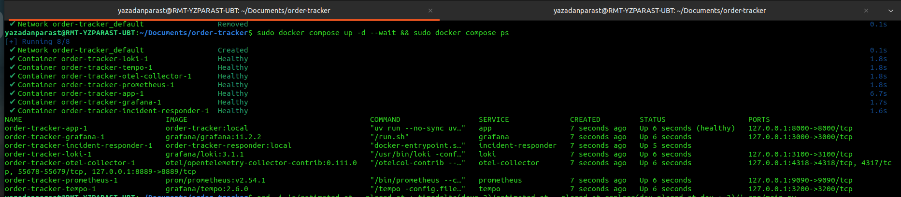
*`compose up -d --wait` **without a service argument** recreates the whole
project after the T6-8 two-container state; `compose ps` confirms app
(healthy), grafana, incident-responder, loki, otel-collector, prometheus and
tempo, ports published on 127.0.0.1.*

**1 — Inject the bug (frame 21).**

    sed -i 's/estimated_at = placed_at + timedelta(days=2)/estimated_at = placed_at.replace(day=placed_at.day + 2)/' app/main.py
    sudo docker build -t order-tracker:local . && sudo docker compose up -d --wait app
    curl -i http://localhost:8000/api/orders/express-1002

Expect `HTTP/1.1 500`. Why inject at all: the deployed image already carried
the timedelta fix, so a burst would return 200s and the rule would —
correctly — stay Normal (frames 12-13). The drill reverts exactly one line;
the *scoped* `up -d --wait app` is right here because the rest of the stack is
already running (the T6-8 mistake was scoping after a full `down`). Note the
all-CACHED build: Docker's content-addressable layers recognised the injected
source from the earlier drill image — the cache is a fingerprint, not a fault.

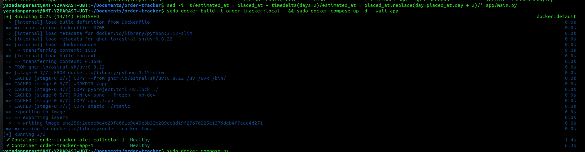
*The sed line; `14/14 FINISHED` with every layer CACHED (identical injected
source to the morning drill image); `Running 2/2` restarting only app and its
collector dependency while the other five services keep running.*

**2 — Keeper loop (frame 22).**

    ( for i in $(seq 1 60); do curl -s -o /dev/null http://localhost:8000/api/orders/express-1002; sleep 20; done ) &
    jobs
    sleep 120

Expect exactly **one** Running job, then a Firing rule after ~2 min (30 s
evaluation + 1 m pending). Purpose per §6.2 stage 1: `rate()` needs changing
samples inside the 5 m window. Read the `jobs` output with your eyes before
starting anything — episode T6-9 is what happens otherwise.

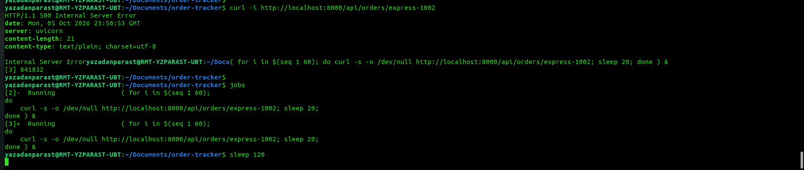
*`curl -i …/express-1002` → `500 Internal Server Error` (planted bug alive);
keeper backgrounded; `jobs` lists the loops; `sleep 120` spans evaluation +
pending so the next look at Grafana is decisive.*

**3 — Observe: dashboard, then rule (frames 23, 24).**

Expect the 5xx panel to climb off zero and the route×status table to gain a
`500` row; then Alerting → Alert rules shows state **Firing** with the
`1 firing` badge.

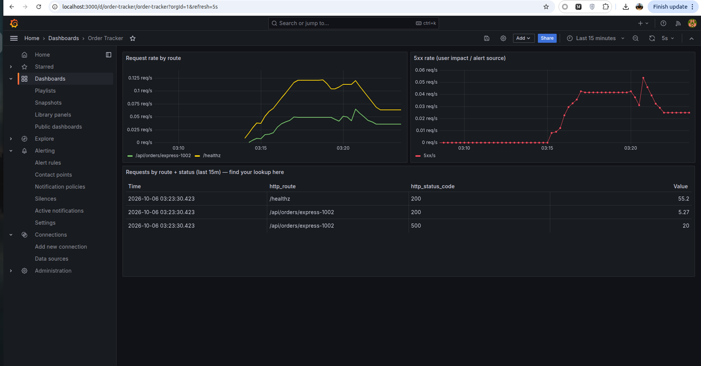
*5xx-rate panel at ~0.04-0.05 req/s (the spike is the duplicate keeper joining,
T6-9); table: `/healthz · 200 · 55.2`, `express-1002 · 200 · 5.27` and
`express-1002 · **500** · 20` — user impact made visible on one screen.*

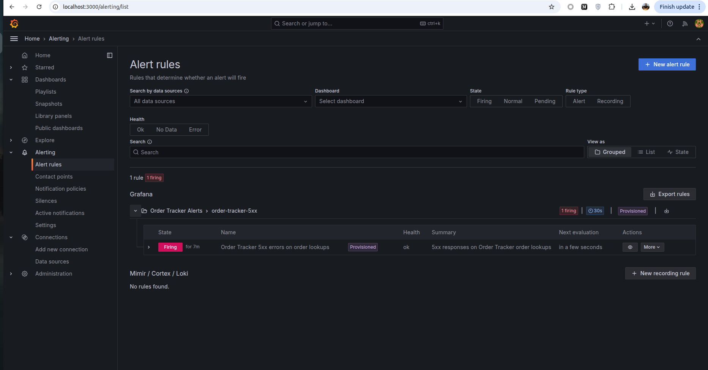
*Alert rules: `1 rule / 1 firing`, group badge `1 firing | 30s | Provisioned`,
rule state **Firing** "for 7m", health ok — debounce passed, the group is out
for delivery to the webhook contact point.*

**4 — Webhook → responder intake (narrative).**
On Firing, the notification policy posts the Grafana v4 payload to
`http://host.docker.internal:8001/alerts`; `responder.py` validates it, opens
`incidents/20261005-235349-fe18ef/`, stores `alert.json`, and — first time on
the proxy-free network — `collect-evidence.sh` returns **collected: true**
with `evidence-logs.json`, `evidence-traces.json`, `evidence-metrics.json`
paths. Finding F-05 closed: with no proxy anywhere, nothing detours and the
collector finishes inside its timeout.

**5 — Authorization, agent, verdict (frame 27).**
Policy evaluates `test: false` + credentials present →
`diagnose-and-fix-within-policy`; the headless Copilot CLI runs with `/repo`
and the docker socket, re-applies the month-end-safe timedelta computation,
rebuilds, restarts, verifies, and writes `response.json`.

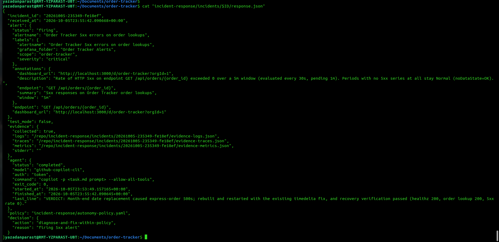
*Incident `20261005-235349-fe18ef`, received 23:55:42, `test_mode: false`;
evidence collected with three JSON artifacts; agent `github-copilot-cli`,
auth `token`, command `copilot -p <task.md prompt> --allow-all-tools`,
exit 0, 23:53:49 → 23:55:42; decision `diagnose-and-fix-within-policy` because
"firing 5xx alert"; last line verbatim: `VERDICT: Month-end date replacement
caused express-order 500s; rebuilt and restarted with the existing timedelta
fix, and recovery verification passed (healthz 200, order lookup 200, 5xx
rate 0).`*

**6 — Keeper cleanup (frames 25, 26).**
Two loops had accumulated (T6-9). Kill them by explicit number and confirm
`jobs` prints nothing before trusting the recovery slope — a stray keeper
keeps the window artificially warm.

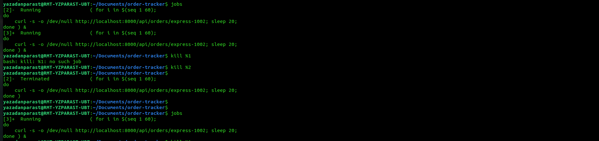
*`jobs` shows loops [2] and [3] both Running; `kill %1` → "no such job" (that
number died with an earlier shell), `kill %2` terminates the first loop.*

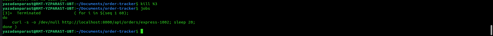
*`kill %3` terminates the second loop; `jobs` prints nothing — the traffic
now on the panels is real traffic only.*

**7 — Recovery proof (frame 28, manifest row 29).**

    curl -i http://localhost:8000/api/orders/express-1002
    sudo docker compose exec incident-responder bash /repo/incident-response/runbooks/verify-recovery.sh

Expect `200 OK` with `"estimated_delivery":"2026-10-02"` and, from inside the
responder, `healthz: 200 / express-1002: 200 / 5xx rate(2m): 0 /
RECOVERY VERIFIED`. Invoke the repo-mounted copy through `bash` (host files
arrive mode 644; the image's own `/app/runbooks/` copy is the executable one)
and type the path plain — a markdown-linked path pasted from chat becomes
`[verify-recovery.sh](…)` and dies with "permission denied".

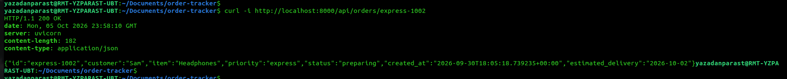
*`200 OK`, `created_at 2026-09-30`, `estimated_delivery 2026-10-02` =
placed + timedelta(days=2): the fix proven on live traffic, Q6 closed with
answer **A**.*

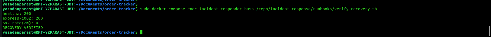
*From inside the responder: `bash /repo/incident-response/runbooks/
verify-recovery.sh` → `healthz: 200`, `express-1002: 200`,
`5xx rate(2m): 0`, `RECOVERY VERIFIED`. The drill closes on live signals,
not on the agent's word — stage 7 of §6.2, captured.*

### 6.4 Troubleshooting episodes

**T6-1 — "No firing state" #1: the burst fell out of the rate window.**
Symptom: five 500s logged, rule Normal. Probes: Prometheus held the series
(`http_server_requests_total{…,"500"} = 6`) yet
`sum(rate(…[5m]))` returned **0**. Root cause: `rate()` measures *change inside the
window*; every sample in `[now-5m, now]` was already 6 (burst ended before the
window start) ⇒ rate 0 ⇒ condition legitimately false. By the time we looked, the
drill window had passed. Fix: trigger and observe within the same window (keeper
loop). Lesson → pitfall #8. (Sandbox cross-check proved the app *does* emit the 500
metric point: `('/api/orders/express-1002','500')`.)

**T6-2 — "No firing state" #2: the masked evaluator (`expression: A` missing).**
Symptom: sustained 5xx, dashboard 0.05 req/s, rule still Normal, health "ok".
Diagnosis: `sudo docker compose logs grafana | grep ngalert` → every tick:
`Failed to build rule evaluator: failed to parse expression 'B': no expression ID is
specified to reduce`. Root cause: a Grafana `reduce` node must declare its input
(`expression: A`); without it the evaluator never builds, and because the rule sets
`execErrState: OK` the UI renders the broken rule as a healthy **Normal** (the rule
detail even showed `Normal (Error)` in state history). Fix:
`sed -i '/^              reducer: last$/a\              expression: A' observability/alerts.yaml`
+ `compose restart grafana` (provisioning re-reads at boot). Lesson → pitfall #7 and
FAQ draft: assert *evaluation* after deploying provisioned alerting, not the badge.

**T6-3 — "No firing state" #3: the threshold node (`expression: B` missing).**
Symptom: post-restart scheduler log: `failed to parse expression 'C': no variable
specified to reference for refId C`. Root cause: in Grafana 10/11 the `threshold`
node also takes its input via top-level `expression:` (legacy
`conditions[].query.params` alone is insufficient). Fix: same sed pattern adding
`expression: B` under `type: threshold` + restart. Result: **Pending → Firing** within
90 s of the keeper (frame 45: "1 firing", Firing for 4 m).

**T6-4 — Incident appears; "where is agent-output.txt?"**
`watch` showed incident `20261005-175355-60e937` at 21:30:32 (frame 47) with
`alert.json`, `evidence-logs.json`, `task.md` but no `agent-output.txt`/`response.json`.
Not a failure: those files are written **after** the copilot subprocess returns (the
responder captures the whole run); `ls` caught evidence collection mid-chain.
Hold pattern: poll for the file, then tail. The run finished 8 m 50 s later with a
**+1 −1** diff and exit code 0.

**T6-5 — Evidence collector timeout + verify-recovery 000s: the `no_proxy` gap.**
Symptom: `response.json` → `evidence.collected: false, error: … timed out after 120
seconds`; `verify-recovery.sh` inside the responder printed `healthz: 000 /
express-1002: 000` while the host curl returned 200. Root cause: compose mapped
`http_proxy`/`https_proxy` into the responder but **not `no_proxy`**, so every
in-stack `localhost:` curl detoured through the corporate proxy (which sees its own
loopback) → hangs/refusals. Fix: `no_proxy: ${no_proxy:-}` added to the service
environment + recreate; re-run → `healthz: 200 / express-1002: 200 / 5xx rate(2m): 0 /
RECOVERY VERIFIED` (frame 51). Lesson → pitfall #9; finding F-05; the agent itself
had already worked around it with `curl --noproxy '*'` learned during the test incident.

**T6-6 — Repeat notification incident `…-47d5ce`.**
While the rule stayed Firing (5 m window after the last 5xx), the notification policy
(`repeat_interval: 1m`) delivered again and the responder opened a second incident.
Policy behaviour: *same alert re-fires after one applied fix ⇒ observe/escalate, no
second change*. Mitigation for future runs: create the 30 m silence immediately after
recovery is verified.

**T6-7 — Recovery, independently verified (Q6 closed).**
Host: `curl -i …/express-1002` → **200 OK** with `"estimated_delivery":"2026-10-02"`
(created 2026-09-30 + `timedelta(days=2)` — the fix is arithmetically correct).
Responder: `verify-recovery.sh` → RECOVERY VERIFIED (frame 51). Rule: Firing →
Normal once the window clears. Agent's verbatim VERDICT (frame 48):
`VERDICT: Express-order lookups returned 500 because adding two to the day field fails at month-end; changed the estimate to use 'timedelta', rebuilt and restarted the app, and recovery verification passed with health and order lookups at 200 and a 5xx rate of 0.`
⇒ **Q6 = A**.

**T6-8 — service-scoped `up` after a full `down` = a two-container stack.**
Symptom: after `docker compose down` + `docker compose up -d --wait app`,
`compose ps` lists only `app` and `otel-collector`; express-1002 returns the
planted 500 and the traceback is in the logs, yet no alert can ever fire.
Diagnosis: a service-scoped `up` creates only the named service and its
`depends_on` closure — Prometheus (evaluator), Grafana (rule owner), Loki,
Tempo and the responder (webhook target) stay removed. The chain has a
producer of 5xx but no consumer of the signal. Root cause: runbook commands
copied the agent's restart incantation (`up -d --wait app`, correct when only
the app image changed) into a context that had just done a full `down`.
Fix: `sudo docker compose up -d --wait` with **no service argument** restores
all seven services; re-verify with `compose ps` (seven rows) before bursting.
Lesson: scope `up` to a service only when the rest of the stack is already
running; after any `down`, bring the whole project up.

**T6-9 — duplicate keeper loops.** Symptom: the 5xx panel shows a sudden
step up (frame 23, ~03:20) and `jobs` lists two Running loops. Diagnosis: a
second keeper was started while the first was still alive — the `jobs || (…)`
guard is useless because `jobs` exits 0 even with an empty list, so only
reading its output helps. Impact: double sample rate (cosmetic here) and
double load; after the fix, a stray loop would also keep the 5 m window warm
and blur the recovery slope. Fix: `kill %2`, `kill %3` by explicit number
(`%1` belonged to a dead shell: "no such job"), verify `jobs` empty.
Lesson: one keeper per drill; jobs are numbered per shell, not per session.

**T6-10 — evidence collector's first green run.** On the proxy-free network
`collect-evidence.sh` completed inside its timeout: `evidence.collected:
true` with logs, traces and metrics artifacts (frame 27) — the exact opposite
of the morning's `timed out after 120 seconds` (T6-5 / F-05). Closing F-05 was
not the `no_proxy` patch alone; it was removing the proxy from the
environment entirely. Recorded as the disposition of finding F-05.

### 6.5 Step-6 evidence frames

20-fullstack-restored · 21-bug-injection · 22-curl500-keeper ·
23-dashboard-5xx-live · 24-rule-firing · 25-keeper-dup-kill ·
26-keeper-cleanup · 27-response-verdict · 28-curl200-restored ·
29-verify-recovery (all under `evidence/`).

### 6.6 Post-drill operator actions

silence expiry check · two commits (`fix(orders): … timedelta …`,
`feat(observability+incident-response): …`) · push fork · submission form answers ·
FAQ issue filed from `FAQ-DRAFT.md` (own URL only).


## Docs (module deliverable: operations-and-security report + trees)
