# HW4 Runbook — Order Tracker: DevOps & Observability for AI-Built Apps

Loop this module builds:
`change → observe user impact → alert with context → investigate from evidence
→ authorize a bounded response or escalate → verify recovery → audit`.
Stack: OpenTelemetry → Collector → Prometheus / Loki / Tempo → Grafana,
plus a responder service that launches a headless coding agent.
Principle: **the model may reason; the system must observe, authorize,
verify, and remember.**

Starter: `alexeygrigorev/order-tracker` (FastAPI + SQLite, compose, tests).
Key facts read from `app/main.py` on 2026-10-04:
- seeds: `standard-1001`, `express-1002` (created_at = previous month-end),
  `standard-1003`;
- `GET /api/orders/{id}` → 404 when absent; `order_detail()` adds
  `estimated_delivery` for express via `placed_at.replace(day=day+2)` —
  overflows the month ⇒ unhandled ValueError ⇒ 500 (the Q6 incident);
- `/healthz` returns `{"status":"ok"}`.

## Step 1 — run the app (Q1)

### Step 1 evidence (real run) + pitfalls

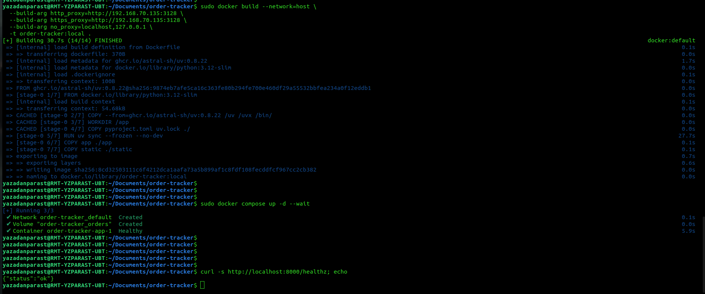
*`docker build --network=host` + proxy build-args → `14/14 FINISHED`;
`docker compose up -d --wait` → `order-tracker-app-1 Healthy`;
`curl /healthz` → `{"status":"ok"}`. Q1 closed.*

- **Pitfall #1 (real): Compose walked UP into the wrong project.** From a
  directory without a compose file, compose v2 searches parent dirs and found
  `~/docker-compose.yml` (an old `api-gw-base` stack), then failed with
  `failed to bind host port 0.0.0.0:80 … address already in use` — nothing to
  do with Order Tracker (which wants :8000). Remedy: `cd` where
  `compose.yaml` lives (nested clone!) and sanity-check with
  `docker compose config --services` (must print `app`) before any `up`.
- **Pitfall #2 (real, HW3 #2 again): bridge-network DNS is dead inside
  `RUN uv sync`** — `files.pythonhosted.org … dns error: Try again`. Remedy:
  build once with `docker build --network=host` plus
  `--build-arg http_proxy/https_proxy/no_proxy`, tag `order-tracker:local`
  (exactly what compose's `image:` line expects), then
  `docker compose up -d --wait` WITHOUT `--build`. Repo files stay
  proxy-free.

## Step 2 — instrument one endpoint, console export (Q2)

Sandbox-verified 2026-10-04 (uv, no docker): starter tests `3 passed` with
instrumentation; live codes `standard-1001 → 200`, `standard-1002 → 404`,
`express-1002 → 500`; console metric `http.server.requests` carries
`http.method` / `http.route` (template) / `http.status_code` plus exemplars
with trace+span ids; structured log bodies `order lookup hit|missed`.
Two traps fixed on the way (keep in mind for docker logs too):
- the periodic metric reader flushed onto pytest's closed stdout ⇒ providers
  are shut down via `atexit`;
- console exporters write to `os.fdopen(os.dup(1))`, a dup of fd 1, so
  background threads never touch the stream pytest swaps per test.
Middleware records 500 for UNHANDLED exceptions before re-raising — the 5xx
alert (Q4) and the express incident (Q6) depend on exactly that.
Kit copies: `hw4-kit/q2/{app/telemetry.py, app/main.py, pyproject.toml, uv.lock}`.

### Step 2 evidence (real run)

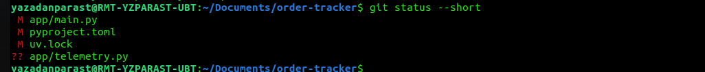
*`M app/main.py`, `M pyproject.toml`, `M uv.lock`, `?? app/telemetry.py` —
after the first attempt left the zip in a staging folder (build went fully
CACHED, logs stayed empty); copying the four files into the tree fixed it.*

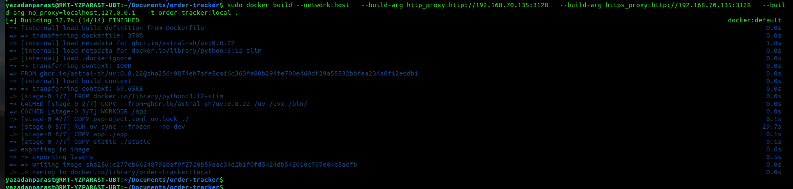
*`COPY pyproject.toml uv.lock` and `RUN uv sync --frozen --no-dev` (29.7 s)
no longer cached ⇒ the image really carries the instrumentation this time.*

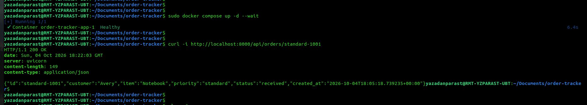

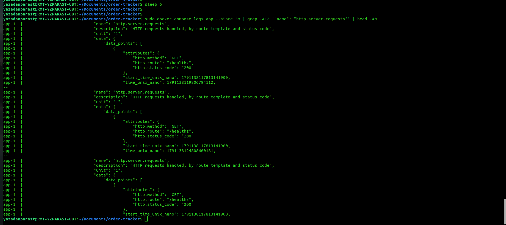
*The visible points are `/healthz` 200 — compose's own 5 s healthcheck probe,
i.e. proof the exporter loop runs; the `/api/orders/{order_id}` 200 point for
the Q2 lookup follows in the same export (frame 08, next batch).*

## Step 3 — telemetry pipeline

### Step 3 evidence (real run)

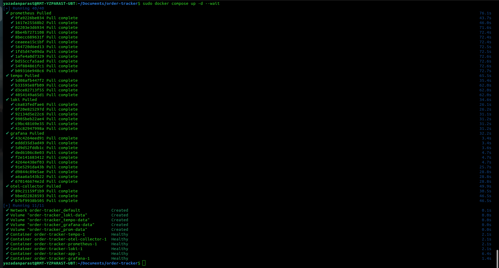

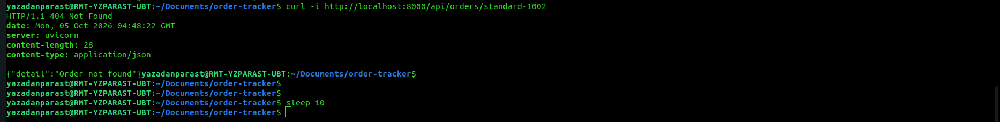

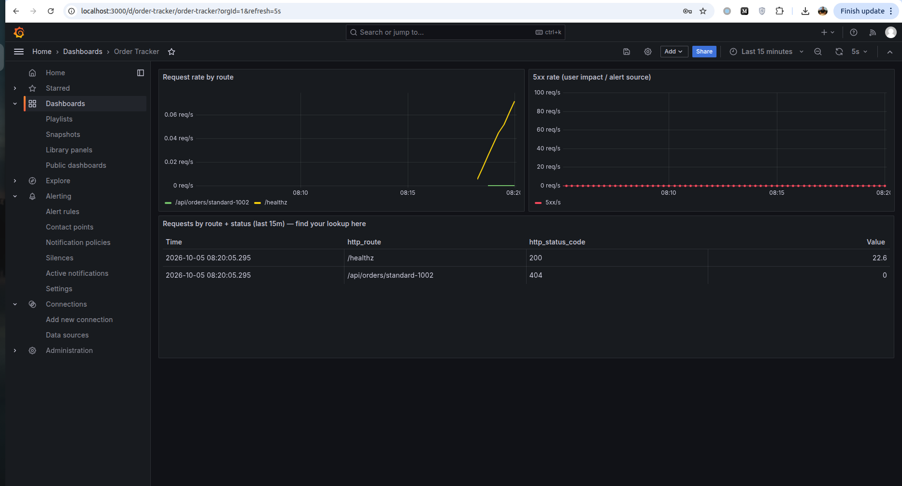
*Table row `http_route=/api/orders/standard-1002`, `http_status_code=404` is the
Q3 metric proof. Its Value reads 0 on first render — Prometheus counter
first-scrape artifact (series' first sample was already 1, so `increase()`
sees 1→1); a repeat curl moves it to 1. The 5xx panel sits flat at 0 — the
quiet baseline Q4's alert must tolerate.*

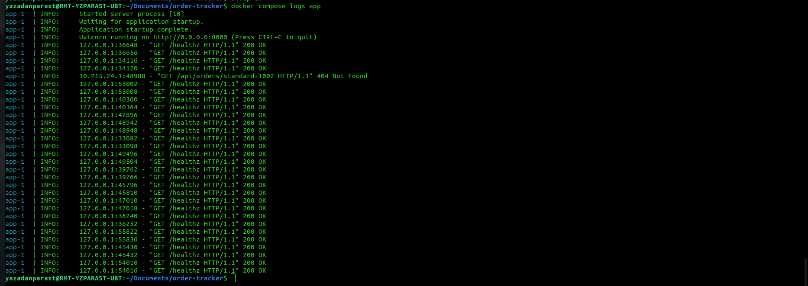

**Pitfall #3 — zips and staging dirs inside the repo.** `hw4-step2.zip`,
`hw4-step3.zip`, `hw4-step3/` were left in the work tree after unzipping and
would have been committed; `rm -rf` them before `git add -A`.

: Collector + Prometheus + Loki + Tempo + Grafana (Q3)

## Step 4 — 5xx alert with context + no-data handling (Q4)


### Step 4 evidence (real run)

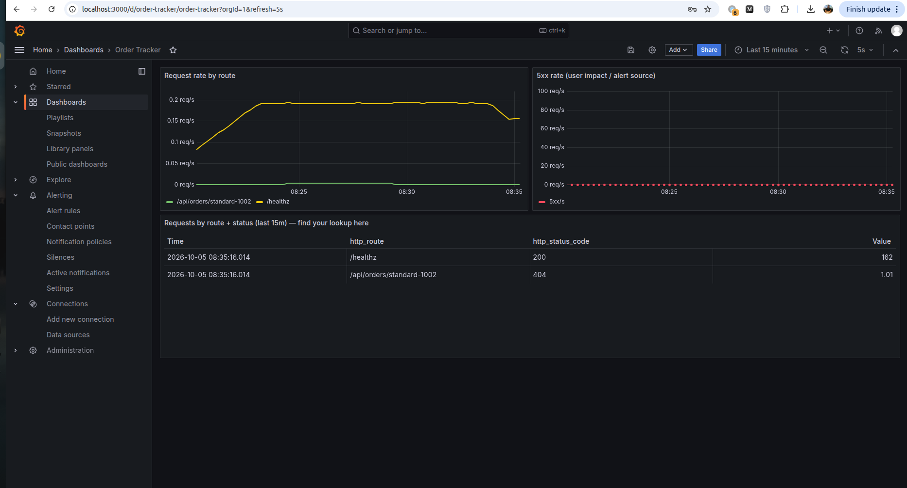
*The 404 row's Value moved 0 → 1.01 once the counter's second increment became
visible to Prometheus — confirms the earlier 0 was the first-scrape artifact.*

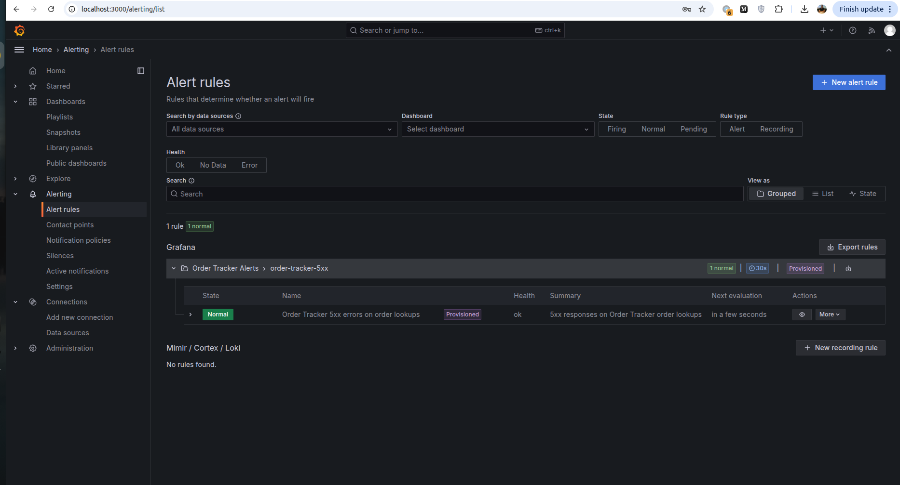
*After `curl -i .../standard-1002` (404, not 5xx) the rule evaluates to
**Normal** — Q4's answer. `noDataState: OK` absorbs the empty 5xx series, so
quiet periods never show "No data".*


## Step 5 — responder service + headless agent (Q5)

### 5.1 What was deployed

`hw4-step5.zip` (later refined by 5b/5c) dropped the whole `incident-response/`
tree into the repo plus an extended `compose.yaml`:

- `responder.py` — FastAPI on **:8001**: `POST /alerts` stores the raw payload
  (`alert.json`), collects evidence (`collect-evidence.sh` → Loki/Tempo/Prometheus),
  launches the headless coding agent with the rendered `responder-task.md` as prompt,
  and writes `response.json` (conforms to `response.schema.json`) including the
  agent's **last line**.
- `autonomy-policy.yaml` — the authorization boundary: may edit `app/*.py`,
  rebuild and restart the app; may **not** touch volumes, topology, credentials
  or git; `test=true` alerts are observe-only; no credentials ⇒ no agent.
- `runbooks/verify-recovery.sh` + `runbooks/rollback.sh`, `incidents/` audit store.
- compose service `incident-responder`: repo mounted at `/repo`, docker socket for
  post-fix restarts, credential + proxy env from the project `.env`.

Agent of choice (user vote): **GitHub Copilot CLI**, headless
`copilot -p "<task>" --allow-all-tools`.

### 5.2 Intended run sequence

```bash
export COPILOT_GITHUB_TOKEN=$(cat ~/.copilot-token)     # or .env channel, see T5-1
unzip -o hw4-step5.zip
sudo docker build --network=host --build-arg http_proxy=… --build-arg https_proxy=… \
  -t order-tracker-responder:local ./incident-response
sudo docker compose up -d --wait
curl -i http://localhost:8001/healthz                   # {"status":"ok"}
curl -i -X POST http://localhost:8001/alerts -H 'Content-Type: application/json' -d '{…ResponderTest test=true…}'
cat incident-response/incidents/<id>/response.json
tail -5 incident-response/incidents/<id>/agent-output.txt
```

### 5.3 Troubleshooting episodes (each one, in order of encounter)

**T5-1 — Agent skipped: "COPILOT_GITHUB_TOKEN not set", although it was exported.**
Symptom: POST returns `agent_last_line: null`; `response.json` →
`agent.status: skipped, reason: COPILOT_GITHUB_TOKEN not set`; no `agent-output.txt`
(incidents `…-f9bbb3`, later `…-09282e`).
Diagnosis: `sudo docker compose exec incident-responder printenv COPILOT_GITHUB_TOKEN`
empty. Root cause: compose ran under **sudo**, which strips the caller's environment,
so `${COPILOT_GITHUB_TOKEN:-}` interpolated to *empty* and the container was **created**
credential-less. Fix: keep the secret in the gitignored project `.env`
(`printf 'COPILOT_GITHUB_TOKEN=%s\n' "$…" > .env`, `.env` added to `.gitignore`
*first*) — compose reads `.env` from disk regardless of sudo — or pass explicitly:
`sudo COPILOT_GITHUB_TOKEN="$…" docker compose up -d`. Verification: printenv prefix
inside the container. Lesson → pitfall #4; this is also the autonomy gate working
(no authorization ⇒ no autonomous agent), kept as positive evidence.

**T5-2 — `Access denied by policy settings` from copilot (container and host).**
Symptom: smoke test `copilot -p "…PONG"` fails with the policy banner listing
org restriction / subscription / admin policy. Diagnosis: separated credential paths —
the host OAuth login (`copilot login`, browser device flow, "Signed in successfully")
versus the fine-grained PAT. Root cause (two layers): the PAT lacked the
**"Copilot requests"** permission (Copilot API answers 403, CLI renders it as policy
denial), and account-level Copilot access must be enabled at
`github.com/settings/copilot`. Fix: re-mint/edit the PAT with *Copilot requests: Read*
on the single repository; verify on the host **before** touching any file:
`COPILOT_GITHUB_TOKEN=$T copilot -p "…PONG"` → PONG (frame 36). Lesson: validate
credentials where the UI can see them before injecting them into infra.

**T5-3 — `401 Bad credentials` inside the container after rotating the PAT.**
Symptom: `Failed to fetch PAT user login (401): GitHub returned: Bad credentials`.
Diagnosis: host PONG worked (it used the *OAuth store*, not the PAT) while the
container used the PAT from `.env` — and that PAT string was dead on arrival
(rotation confusion). Root cause: containers keep the env they were **created** with;
writing `.env` afterwards changes nothing until recreate. Fix: recreate
(`sudo docker compose up -d --wait`) *and* adopt the verify-before-use checklist
(`curl -s -H "Authorization: Bearer $T" https://api.github.com/user` must print the
login). Lesson: a 401 on `/user` is always the token string, never scopes or proxy.

**T5-4 — `network fetch failed`: the corporate proxy refuses the bridge netns.**
Symptom: in-container copilot: `error sending request for url
(https://api.github.com/copilot_internal/user)`; diagnostics inside the container:
DNS ok, `curl -x http://192.168.70.135:3128 https://api.github.com/zen` →
`Connection refused`, while the identical connect from the host succeeds.
Root cause: proxy/forwarding path rejects TCP originating from the compose bridge
network (host netns is accepted). Fix (`hw4-step5b.zip`): responder gets
`network_mode: host`; evidence/verify scripts re-pointed to published
`127.0.0.1` ports (`localhost:3100/3200/9090/8000`); Grafana reaches the responder
via `extra_hosts: host.docker.internal:host-gateway` and the contact point URL
becomes `http://host.docker.internal:8001/alerts`. Verification: zen quote + later
PONG from inside the container. Trade-off documented (F-02): wider network reach,
bounded by the autonomy policy. Lesson → pitfall #5.

**T5-5 — Silent exit 1, empty `agent-output.txt`.**
Symptom: `agent.status: completed, exit_code: 1, last_line "(no output)"`; stderr
empty; copilot's own log (mounted store) needed `sudo cat`. Root cause: the OAuth
store was mounted **read-only**, but copilot's `session-store.db` is a SQLite
**WAL** database — authentication cannot open it without write access to `-wal/-shm`.
Fix: drop `:ro` from the mount (`sed -i 's|:/root/.copilot:ro|:/root/.copilot|'
compose.yaml`) + recreate. Lesson: stateful CLI stores need writable mounts; when a
CLI dies silently, read *its* log directory, not just stderr.

**T5-6 — `No authentication information found`: the keyring vault.**
Symptom: with the writable store mounted and no token env, copilot still sees no
credentials. Root cause: `copilot login` on a desktop stores OAuth in the **session
keyring**; `~/.copilot` held session state only. Containers have no keyring.
Fix (the pattern that closed Q5): run `copilot login` **inside the responder**
(`sudo docker compose exec incident-responder copilot login`); the device-flow
callback port binds on the host loopback *because of host networking*, so the host
browser completes it; accept `Store token in plaintext config file? y` → the store
lands in the mounted `/root/.copilot` and survives recreates. Companion responder
patch (`hw4-step5c.zip`): the launch gate accepts **token OR mounted OAuth store**
(`_copilot_credentials()`), recording which one as `agent.auth`. Lesson → pitfall #6;
full credential lifecycle in `security-audit/credentials-handling.md`.

**T5-7 — Green path (Q5 closed).**
In-container PONG (frame 39), then the homework test POST → incident
`20261005-103931-5db41b`, `agent.status: completed, auth: oauth-store`,
decision `observe-only / test notification`, and the verbatim last line:
`VERDICT: Test alert required no changes; the app is healthy and the health endpoint returned HTTP 200 via localhost.`
(frame 40). That line is the Q5 free-text answer.

### 5.4 Step-5 evidence frames

04-tree · 25/26/27-compose · 28-npm · 29-oauth-callback · 30-login-version ·
31-build · 32-up-healthz · 37-credentials-hygiene · 36-host-pong ·
39-container-login-pong-VERDICT-POST · 40-incident-verdict (all under `evidence/`,
success path only; every failure above is documented as prose + log lines).

## Step 6 — Grafana webhook → real incident → agent fix → verify recovery (Q6)

### 6.1 The chain, end to end

metric (`http.server.requests` with route+status) → Prometheus (collector :8889) →
Grafana rule `order-5xx-rate` (30 s eval, `for: 1m`) → **Firing** → webhook contact
point → `http://host.docker.internal:8001/alerts` → responder opens incident →
evidence (Loki labels / Tempo TraceQL / Prometheus) → headless Copilot CLI reads
`task.md` + evidence → diagnoses → patches `app/main.py` → `docker build` →
`docker compose up -d --wait app` → `verify-recovery.sh` → VERDICT line →
operator re-verifies independently → rule falls back to Normal.
In one sentence: *complete end-to-end: metric → alert → webhook → responder →
evidence → headless agent → one-line fix → rebuilt → restarted → independently
verified.*

### 6.2 Trigger & observation procedure

```bash
# sustained 5xx INSIDE the 5m rate window (the keeper):
for i in $(seq 1 15); do curl -s -o /dev/null -w '%{http_code} ' \
  http://localhost:8000/api/orders/express-1002; sleep 10; done; echo
# T+30-60 s Pending · T+90-120 s FIRING (badge frames 45) · webhook fires at Firing
watch -n5 'ls -t incident-response/incidents | head -2'   # new id = incident opened
tail -f incident-response/incidents/<id>/agent-output.txt # VERDICT ends the run
kill %1                     # stop keeper once the agent is at work
# silence 30 m after recovery is proven (stops repeat agent launches)
```

### 6.3 Troubleshooting episodes

**T6-1 — "No firing state" #1: the burst fell out of the rate window.**
Symptom: five 500s logged, rule Normal. Probes: Prometheus held the series
(`http_server_requests_total{…,"500"} = 6`) yet
`sum(rate(…[5m]))` returned **0**. Root cause: `rate()` measures *change inside the
window*; every sample in `[now-5m, now]` was already 6 (burst ended before the
window start) ⇒ rate 0 ⇒ condition legitimately false. By the time we looked, the
drill window had passed. Fix: trigger and observe within the same window (keeper
loop). Lesson → pitfall #8. (Sandbox cross-check proved the app *does* emit the 500
metric point: `('/api/orders/express-1002','500')`.)

**T6-2 — "No firing state" #2: the masked evaluator (`expression: A` missing).**
Symptom: sustained 5xx, dashboard 0.05 req/s, rule still Normal, health "ok".
Diagnosis: `sudo docker compose logs grafana | grep ngalert` → every tick:
`Failed to build rule evaluator: failed to parse expression 'B': no expression ID is
specified to reduce`. Root cause: a Grafana `reduce` node must declare its input
(`expression: A`); without it the evaluator never builds, and because the rule sets
`execErrState: OK` the UI renders the broken rule as a healthy **Normal** (the rule
detail even showed `Normal (Error)` in state history). Fix:
`sed -i '/^              reducer: last$/a\              expression: A' observability/alerts.yaml`
+ `compose restart grafana` (provisioning re-reads at boot). Lesson → pitfall #7 and
FAQ draft: assert *evaluation* after deploying provisioned alerting, not the badge.

**T6-3 — "No firing state" #3: the threshold node (`expression: B` missing).**
Symptom: post-restart scheduler log: `failed to parse expression 'C': no variable
specified to reference for refId C`. Root cause: in Grafana 10/11 the `threshold`
node also takes its input via top-level `expression:` (legacy
`conditions[].query.params` alone is insufficient). Fix: same sed pattern adding
`expression: B` under `type: threshold` + restart. Result: **Pending → Firing** within
90 s of the keeper (frame 45: "1 firing", Firing for 4 m).

**T6-4 — Incident appears; "where is agent-output.txt?"**
`watch` showed incident `20261005-175355-60e937` at 21:30:32 (frame 47) with
`alert.json`, `evidence-logs.json`, `task.md` but no `agent-output.txt`/`response.json`.
Not a failure: those files are written **after** the copilot subprocess returns (the
responder captures the whole run); `ls` caught evidence collection mid-chain.
Hold pattern: poll for the file, then tail. The run finished 8 m 50 s later with a
**+1 −1** diff and exit code 0.

**T6-5 — Evidence collector timeout + verify-recovery 000s: the `no_proxy` gap.**
Symptom: `response.json` → `evidence.collected: false, error: … timed out after 120
seconds`; `verify-recovery.sh` inside the responder printed `healthz: 000 /
express-1002: 000` while the host curl returned 200. Root cause: compose mapped
`http_proxy`/`https_proxy` into the responder but **not `no_proxy`**, so every
in-stack `localhost:` curl detoured through the corporate proxy (which sees its own
loopback) → hangs/refusals. Fix: `no_proxy: ${no_proxy:-}` added to the service
environment + recreate; re-run → `healthz: 200 / express-1002: 200 / 5xx rate(2m): 0 /
RECOVERY VERIFIED` (frame 51). Lesson → pitfall #9; finding F-05; the agent itself
had already worked around it with `curl --noproxy '*'` learned during the test incident.

**T6-6 — Repeat notification incident `…-47d5ce`.**
While the rule stayed Firing (5 m window after the last 5xx), the notification policy
(`repeat_interval: 1m`) delivered again and the responder opened a second incident.
Policy behaviour: *same alert re-fires after one applied fix ⇒ observe/escalate, no
second change*. Mitigation for future runs: create the 30 m silence immediately after
recovery is verified.

**T6-7 — Recovery, independently verified (Q6 closed).**
Host: `curl -i …/express-1002` → **200 OK** with `"estimated_delivery":"2026-10-02"`
(created 2026-09-30 + `timedelta(days=2)` — the fix is arithmetically correct).
Responder: `verify-recovery.sh` → RECOVERY VERIFIED (frame 51). Rule: Firing →
Normal once the window clears. Agent's verbatim VERDICT (frame 48):
`VERDICT: Express-order lookups returned 500 because adding two to the day field fails at month-end; changed the estimate to use 'timedelta', rebuilt and restarted the app, and recovery verification passed with health and order lookups at 200 and a 5xx rate of 0.`
⇒ **Q6 = A**.

### 6.4 Step-6 evidence frames

41-keeper · 42-threshold-patch-restart · 43/44-alerts-yaml · 45-rule-firing ·
46-dashboard-5xx-live · 47-incident-appeared · 48-verdict-fix ·
49-incidents-response · 50-curl200-verify000 · 51-recovery-verified.

### 6.5 Post-drill operator actions

silence expiry check · two commits (`fix(orders): … timedelta …`,
`feat(observability+incident-response): …`) · push fork · submission form answers ·
FAQ issue filed from `FAQ-DRAFT.md` (own URL only).


## Docs (module deliverable: operations-and-security report + trees)
